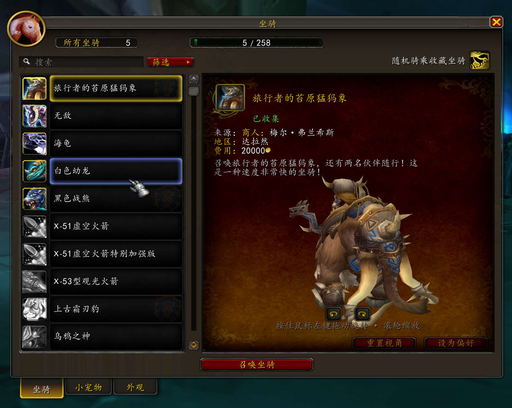
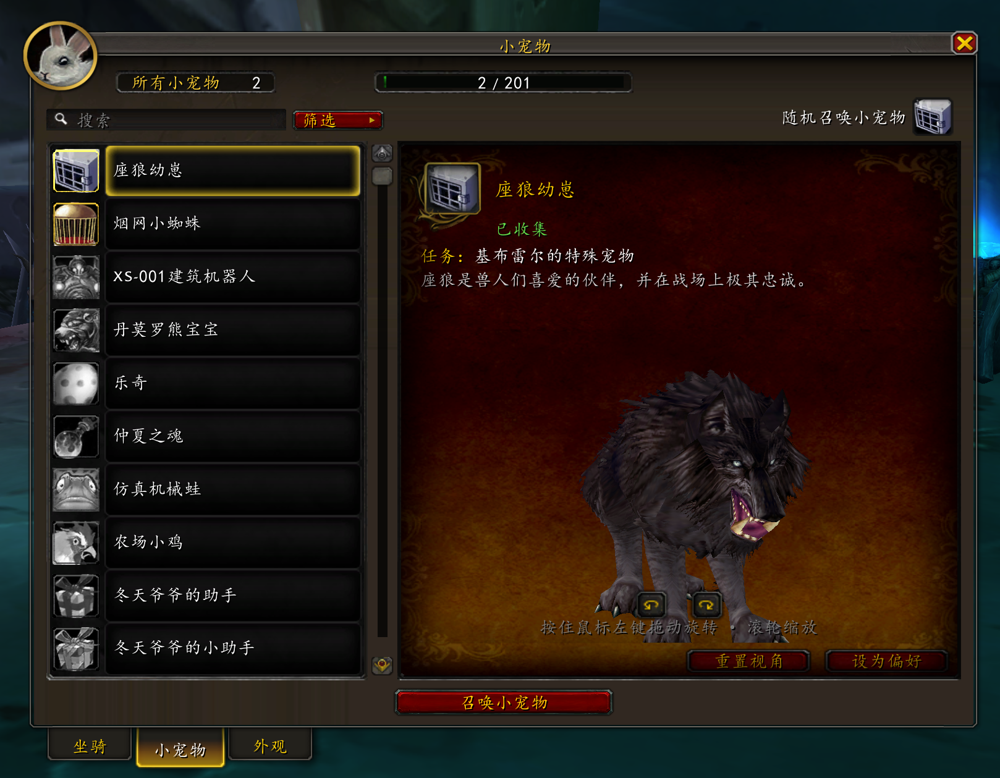
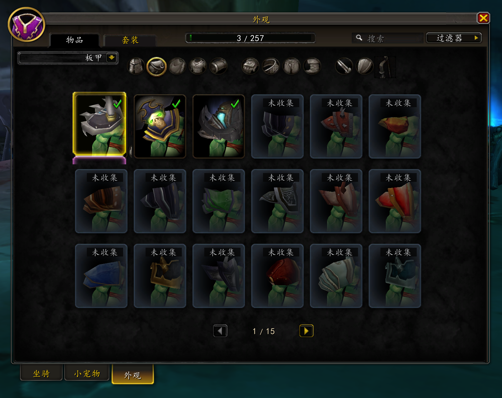
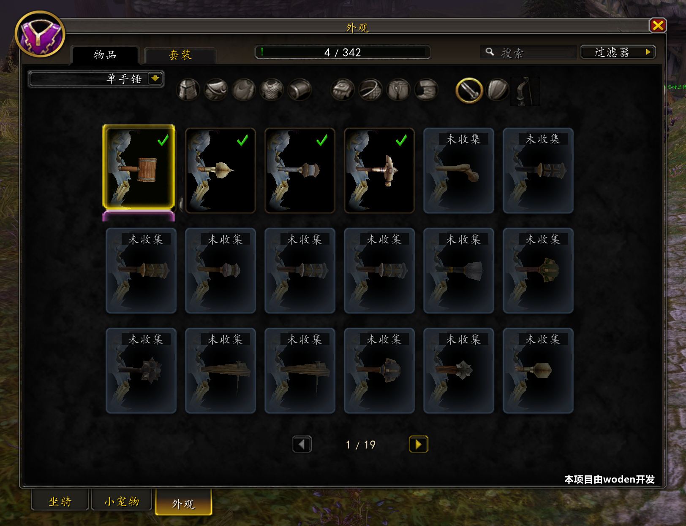
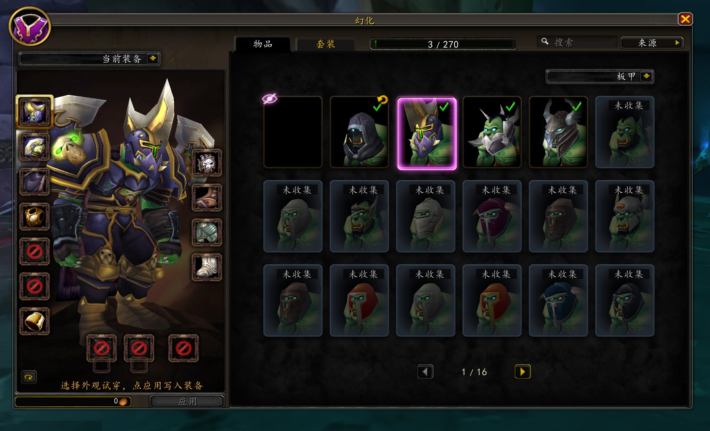
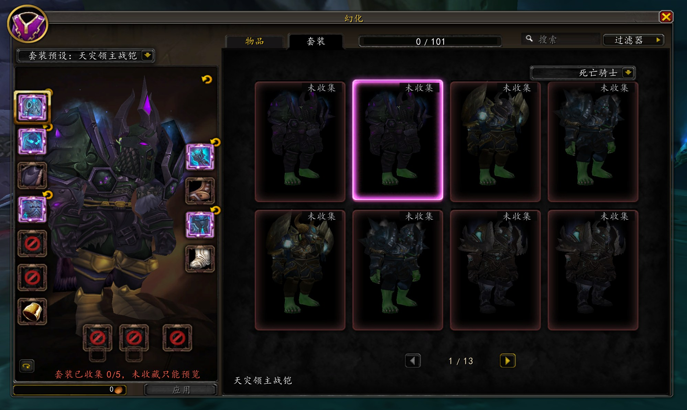
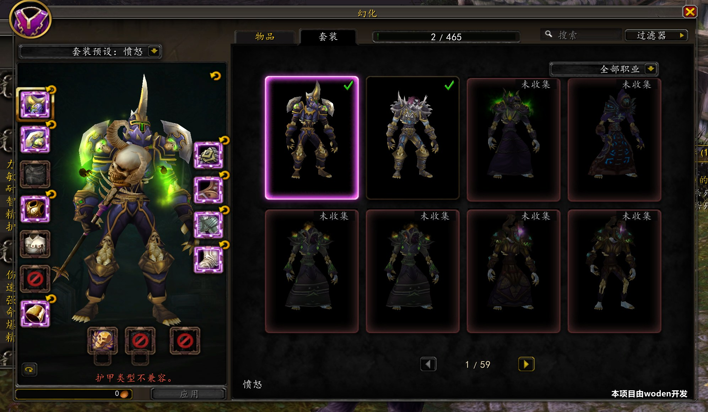

# SoloCollectionsPlatform

**Account-wide Collections System & Legion-style Transmogrification Platform for World of Warcraft 3.3.5a (WotLK 12340)**

[English](README.en.md) · [简体中文](README.md) · [Releases](https://github.com/haha2345/SoloCollectionsPlatform/releases) · [Release Notes](docs/RELEASE.zh-CN.md) · [AzerothCore Module](https://github.com/haha2345/mod-solo-collections)

[](https://github.com/haha2345/SoloCollectionsPlatform/releases/tag/v0.3.2)
[](https://www.azerothcore.org/)
[-GPL--3.0--or--later-green.svg)](https://www.gnu.org/licenses/gpl-3.0.html)
[-AGPL--3.0-blueviolet.svg)](https://www.gnu.org/licenses/agpl-3.0.html)

---

## 📑 Table of Contents

- [1. Overview & Core Value](#1-overview--core-value)
  - [1.1 What is SoloCollectionsPlatform?](#11-what-is-solocollectionsplatform)
  - [1.2 Pain Points Solved](#12-pain-points-solved)
  - [1.3 Key Technical Metrics](#13-key-technical-metrics)
- [2. System Architecture & Submodules](#2-system-architecture--submodules)
  - [2.1 Workspace Structure](#21-workspace-structure)
  - [2.2 Data Flow & Authority Boundaries](#22-data-flow--authority-boundaries)
- [3. UI Previews & Feature Showcase](#3-ui-previews--feature-showcase)
  - [3.1 Collections Journal](#31-collections-journal)
  - [3.2 Standalone Legion-style Wardrobe Studio](#32-standalone-legion-style-wardrobe-studio)
- [4. Installation & Deployment Guide](#4-installation--deployment-guide)
  - [4.1 Prerequisites](#41-prerequisites)
  - [4.2 Server Module Deployment (mod-solo-collections)](#42-server-module-deployment-mod-solo-collections)
  - [4.3 Client AddOn Deployment (SoloCollections)](#43-client-addon-deployment-solocollections)
- [5. Build & Compilation Guide](#5-build--compilation-guide)
  - [5.1 Server-side Compilation (C++)](#51-server-side-compilation-c)
  - [5.2 Catalog Generation Tools (Python)](#52-catalog-generation-tools-python)
  - [5.3 Camera Extension Compilation (SoloCam C++)](#53-camera-extension-compilation-solocam-c)
- [6. Agent Guidance (Automated Deployment & AI Agent Manual)](#6-agent-guidance-automated-deployment--ai-agent-manual)
  - [6.1 Critical Rules & Non-negotiables](#61-critical-rules--non-negotiables)
  - [6.2 Agent One-Click Deployment & Hot Reload Script](#62-agent-one-click-deployment--hot-reload-script)
  - [6.3 Automated QA Acceptance Testing Guide](#63-automated-qa-acceptance-testing-guide)
  - [6.4 Troubleshooting Decision Tree](#64-troubleshooting-decision-tree)
- [7. How to Contribute](#7-how-to-contribute)
- [8. Roadmap & Pending Features (TODO List)](#8-roadmap--pending-features-todo-list)
- [9. Licensing & Acknowledgments](#9-licensing--acknowledgments)

---

## 1. Overview & Core Value

### 1.1 What is SoloCollectionsPlatform?
`SoloCollectionsPlatform` is a modern, comprehensive collections system and standalone transmogrification studio designed specifically for **World of Warcraft 3.3.5a (Build 12340)**. It brings the modern Retail collection experience (Legion/Dragonflight style) to the 3.3.5a classic era, providing a complete technical ecosystem with **client-server separation, strict server-side authority, strongly-typed binary verification, and ultra-smooth UI responsiveness**.

**Account-wide Sharing**: Mounts, companions/pets, and equipment appearances are seamlessly shared across all characters under the same account.

### 1.2 Pain Points Solved
1. **Lack of Account-wide Collections in 3.3.5a**: Native 3.3.5a mounts and non-combat pets consume inventory/spellbook slots with no account-wide wardrobe or set collection progress tracking.
2. **Architectural Flaws in Legacy Transmog AddOns (e.g., legacy Transmog / SC1 / ALE)**:
   - Relied on client calculations and weakly validated protocols, leading to client manipulation, desynchronization, and ghost appearances.
   - High memory footprint, frequent frame creation/destruction causing lag spikes and memory leaks.
3. **Limited Viewport Expressiveness in Native DressUpModel**: Native 3.3.5a model controls cannot provide close-up framing or viewport compensation for different races, genders, equipment slots (e.g., helms, shoulders, gloves, boots), or oversized weapons.
4. **Lack of Modern Engineering & Automated Acceptance Tooling**: Historical private server AddOns mostly relied on black-box manual debugging without multi-client concurrency testing or data consistency pipelines.

### 1.3 Key Technical Metrics
- **19,146 Canonical Catalog Entries**: Includes 281 mounts, 201 non-combat pets, 9 reviewed toys, 18,190 appearance items, and 465 classic armor sets; 3,690 public weapon presentation candidates (3,541 marked `READY`).
- **SC2 Chunked Binary Synchronization Protocol**: Full snapshot chunking, incremental revision checksum validation, and immediate safe fail-closed mechanics.
- **180 Race/Gender/Slot Close-up Camera Profiles**: Combined with the optional 32-bit x86 SoloCam injection extension for millimeter-precise viewport centering.
- **Zero-focus Background Automated Acceptance Framework**: End-to-end multi-client automated verification based on `PostMessage` + `PrintWindow` + `SavedVariables` + `Server.log`.

---

## 2. System Architecture & Submodules

### 2.1 Workspace Structure

```text
SoloCollectionsPlatform (Platform Workspace)
├── SoloCollections/               # Client AddOn, catalog generator, SC2 protocol, SoloCam extension
│   ├── addon/SoloCollections/      # 3.3.5a Lua/FrameXML AddOn source (Collections Journal + Transmog Lab)
│   ├── client-extension/SoloCam/   # 32-bit C++ client camera DLL injection extension
│   ├── tools/collections/          # Python catalog specification generator, schema validation & exporter
│   └── docs/                       # Architecture, protocol specs, camera profiles, acceptance records
│
├── mod-solo-collections/           # AzerothCore C++ server-authoritative module
│   ├── src/                        # C++ business logic, provider registration, SC2 networking, transmog core
│   ├── data/sql/                   # Database migrations & account-wide schemas
│   └── conf/                       # Server configuration template mod_solo_collections.conf.dist
│
├── SoloClientSuite/                # Full client UI integration suite (DragonUI, ClassicAPI, NewEra, etc.)
│   ├── Interface/AddOns/           # Decoupled AddOn collection
│   └── tools/                      # Suite packaging, lockfile validation & release scripts
│
└── _work/                          # Automated QA framework, baseline audits, regression history
    └── qa-framework/               # Multi-client headless background E2E acceptance suite
```

### 2.2 Data Flow & Authority Boundaries

```text
       +-------------------------------------------------------+
       |             catalog/ Canonical Source List            |
       +-------------------------------------------------------+
                     │                                   │
                     ▼                                   ▼
+------------------------------------+  +------------------------------------+
|  Generated AddOn Data (Lua Tables) |  |  Generated C++ Code (.inc Tables)  |
|  addon/SoloCollections/Data/       |  |  mod-solo-collections/src/         |
+------------------------------------+  +------------------------------------+
                     │                                   │
                     ▼                                   ▼
+------------------------------------+  SC2 Protocol +------------------------------------+
|         WoW 3.3.5a Client          | <===========> |         AzerothCore Server         |
|  - UI & Presentation (FrameXML)    | (Chunk/Delta) |  - Sole Authority (C++ Backend)    |
|  - User Intent (typeId/actionId)   |               |  - MySQL Persistence (characters)  |
|  - Blocks locked/incompatible ops  |               |  - Final Authorization & Costing   |
+------------------------------------+               +------------------------------------+
```

---

## 3. UI Previews & Feature Showcase

### 3.1 Collections Journal

Provides a sleek, Retail-inspired collections interface for browsing mounts, companions, equipment appearances, and armor sets.

#### 🏇 Mounts & Companions
- **Mount System**: Rideable from Level 1, automatically learns riding skills, unlocks flying at Level 45, and max flight speed at Level 60 with full Old World flight support. Features one-click random mount summoning and direct action-bar icon dragging.
- **Companion Pets**: Browse account-wide non-combat pets with 3D model previews, lore descriptions, and one-click random pet summoning.

| Mount Journal | Pet Companion Journal |
| :---: | :---: |
|  |  |
| *Summon random mount, drag to action bar, Level 1 riding & global flight* | *Random pet summoning with interactive 3D model preview* |

#### 🛡️ Equipment Appearances & Armor Filtering
- Dedicated close-up camera angles and progress bars for Head, Shoulders, Cloak, Chest, Wrists, Gloves, Waist, Legs, and Boots.
- Quick one-click filtering across armor types: Plate, Mail, Leather, and Cloth.

| Appearance Slot Browser | Armor Type Filtering |
| :---: | :---: |
|  |  |
| *Slot-specific close-up framing with real-time collection progress* | *Instant filtering across Plate / Mail / Leather / Cloth appearances* |

#### ⚔️ Weapon Appearances & Classic Sets
- **Standalone Weapon Model Previews**: Tailored camera rendering for 1H/2H Swords, Daggers, Staves, Polearms, Bows, Crossbows, and Shields.
- **Classic Set Catalog**: Covers iconic T1~T10 and S1~S8 sets with clear tier labeling, completion counters, and full-set dressing room previews.

| Standalone Weapon Display | Classic Sets & Progress Tracking |
| :---: | :---: |
|  |  |
| *Independent weapon model rendering & viewport optimization* | *T1~T10 / PvP Season sets with full dressing-room previews* |

---

### 3.2 Standalone Legion-style Wardrobe Studio

Replaces legacy NPC text dialogs with a modern, Legion-style standalone transmogrification dressing room.

- **Real-time Visual Transmog**: Customize each slot independently with real-time cost calculation and server-enforced validation.
- **One-Click Set Transmogrification**: Apply full collected sets in a single action.
- **Cross-Armor & Cross-Weapon Support**: Configurable server-side rules to permit cross-armor (e.g., Priests wearing Plate visuals) and cross-weapon type transmogrification.

| Legion-style Transmog Studio | Full Set Transmogrification | Cross-Armor Transmog (Priest with Plate) |
| :---: | :---: | :---: |
|  |  |  |
| *Dedicated high-fidelity UI with real-time costing & server auth* | *One-click preview and apply iconic class sets* | *Configurable server-side cross-armor & cross-weapon transmog* |

---

## 4. Installation & Deployment Guide

### 4.1 Prerequisites
- **Server**: AzerothCore WotLK (`master` branch or compatible), MySQL 8.0 / 8.4+
- **Client**: World of Warcraft 3.3.5a (Build 12340), 32-bit Windows client

---

### 4.2 Server Module Deployment (`mod-solo-collections`)

1. **Clone into AzerothCore modules directory**:
   ```powershell
   cd <AzerothCore_Root>/modules
   git clone https://github.com/haha2345/mod-solo-collections.git mod-solo-collections
   ```
   *Ensure the path structure is `<AzerothCore_Root>/modules/mod-solo-collections/include.sh`*

2. **Import database schemas**:
   ```bash
   mysql -u root -p characters < modules/mod-solo-collections/data/sql/db-characters/base_solo_collections.sql
   mysql -u root -p world < modules/mod-solo-collections/data/sql/db-world/base_solo_collections_world.sql
   ```

3. **Configure the module**:
   Copy the sample configuration and adjust as needed:
   ```powershell
   cp <AzerothCore_Root>/modules/mod-solo-collections/conf/mod_solo_collections.conf.dist <Runtime_Dir>/etc/mod_solo_collections.conf
   ```
   **Key Configuration Directives**:
   ```ini
   SoloCollections.Enable = 1
   SoloCollections.Backend = "Cpp"            # Must be Cpp for sole server authority
   SoloCollections.Transmog.Enable = 1        # Enable transmogrification
   SoloCollections.Transmog.CostModifier = 1.0 # Transmog cost multiplier
   ```

---

### 4.3 Client AddOn Deployment (`SoloCollections`)

1. **Copy the AddOn to your client**:
   Copy `SoloCollections/addon/SoloCollections` into your client's `Interface/AddOns/` directory:
   ```text
   World of Warcraft/
   └── Interface/
       └── AddOns/
           └── SoloCollections/
               ├── SoloCollections.toc
               ├── SoloCollections.lua
               ├── Core/
               ├── Data/
               └── UI/
   ```

2. **(Optional) Install SoloCam Camera Extension**:
   For enhanced close-up camera framing, place the compiled `SoloCam.dll` into the game root directory and launch using the accompanying injector/loader.

3. **In-game Command Verification**:
   - `/sc` or `/collections`: Open the Collections Journal.
   - `/tmog` or `/transmog`: Open the standalone Wardrobe Studio.
   - `/sc reset`: Reset local UI positions and filter state.

---

## 5. Build & Compilation Guide

### 5.1 Server-side Compilation (C++)

#### Prerequisites
- **Windows**: Windows 10/11, Visual Studio 2022 (**Desktop development with C++**), CMake 3.27+, Boost 1.78+, OpenSSL 3.x, MySQL Connector 8.0/8.4.
- **Linux**: Ubuntu 22.04 LTS+, `build-essential`, `cmake`, `libboost-all-dev`, `libssl-dev`, `libmysqlclient-dev`, `clang` or `gcc-11+`.

#### Build Steps
```powershell
# 1. Generate version metadata (ensures AddOn and C++ Module hashes match strictly)
& .\SoloCollections\tools\release\New-SoloCollectionsBuildInfo.ps1 `
  -AddonRoot .\SoloCollections `
  -ModuleRoot .\mod-solo-collections `
  -CoreRoot <AzerothCore_Root> `
  -CoreBuildRoot <AzerothCore_Build_Dir>

# 2. CMake configuration and compilation
cd <AzerothCore_Build_Dir>
cmake -B . -S <AzerothCore_Root> -DMODULES=static -DCMAKE_BUILD_TYPE=RelWithDebInfo
cmake --build . --config RelWithDebInfo --target worldserver -j 8
```

---

### 5.2 Catalog Generation Tools (Python)

After modifying raw YAML/JSON files under `catalog/`, run the generator tools to regenerate Lua and C++ projection tables:

```powershell
# Requires Python 3.10+
cd .\SoloCollections\tools\collections
python build_catalog.py --verify-all
python export_addon_lua.py --output-dir ..\..\addon\SoloCollections\Data\Generated
python export_server_inc.py --output-dir ..\..\..\mod-solo-collections\src\generated
```

---

### 5.3 Camera Extension Compilation (SoloCam C++)

Open `SoloCollections/client-extension/SoloCam/SoloCam.sln` in Visual Studio:
- **Target Platform**: `Release` | `x86` (32-bit MSVC)
- **Output Artifact**: `SoloCam.dll`

---

## 6. Agent Guidance (Automated Deployment & AI Agent Manual)

> **💡 Quick Guide for Coding Agents (Claude, Codex, GPT, etc.)**:
> This section provides standardized context for automated code inspection, debugging, testing, and safe deployment.

### 6.1 Critical Rules & Non-negotiables
1. **Server as Sole Authority**: Any collection unlock (`IsCollected`), transmog modification, gold deduction, or item consumption must be authorized strictly by `mod-solo-collections` (C++). **Never** simulate or bypass authorization logic in client Lua.
2. **Do Not Hand-edit Generated Files**: `Data/Generated/*.lua` and `src/generated/*.inc` are auto-generated. Manual edits will be overwritten. Always edit source catalog files under `catalog/` and run generation scripts.
3. **No Hardcoded Absolute Paths**: Never commit developer-specific absolute paths (e.g., `D:\Games\...` or `F:\1_projects\...`) to version control.
4. **Git Branching Boundaries**:
   - `main`: Stable production branch (currently excludes deferred Toy Box and Title Journal).
   - `feat/deferred-toy-box`: Toy Box deferred development branch.
   - `feat/deferred-title-journal`: Title Journal deferred development branch.

---

### 6.2 Agent One-Click Deployment & Hot Reload Script (PowerShell)

Use this script to safely synchronize AddOn changes to a local test client after editing:

```powershell
# Agent fast AddOn sync script
$SourceAddon = "F:\1_projects\wow_projects\SoloCollectionsPlatform\SoloCollections\addon\SoloCollections"
$ClientAddon = "D:\Games\wow335\World of Warcraft11\Interface\AddOns\SoloCollections"

if ((Test-Path $SourceAddon) -and (Test-Path $ClientAddon)) {
    Write-Host "[Agent Deploy] Syncing AddOn source to client..." -ForegroundColor Cyan
    & robocopy $SourceAddon $ClientAddon /MIR /NFL /NDL /NJH /NJS /NC /NS
    if ($LASTEXITCODE -lt 8) {
        Write-Host "[Agent Deploy] Deployment successful! Type /reload in game to apply changes." -ForegroundColor Green
    } else {
        Write-Error "[Agent Deploy] Robocopy failed with exit code: $LASTEXITCODE"
    }
} else {
    Write-Warning "[Agent Deploy] Target path does not exist. Check configuration."
}
```

---

### 6.3 Automated QA Acceptance Testing Guide

The integrated QA acceptance suite is located under `_work/qa-framework/`.

```powershell
# Run end-to-end acceptance tests (runs completely in background without stealing window focus)
cd F:\1_projects\wow_projects\SoloCollectionsPlatform\_work\qa-framework
.\Run-Acceptance.ps1 -Suite suites/transmog.lua
```

- **Three-way Cross-Validation**:
  1. `PostMessage` sends unfocused background keystrokes and chat commands.
  2. In-game `SoloCollectionsQaRunner` executes asynchronous test steps and records results in `SavedVariables`.
  3. Orchestrator compares incremental `worldserver` `Server.log` entries with MySQL `characters` tables.

---

### 6.4 Troubleshooting Decision Tree

| Symptom | Probable Cause | Diagnostic & Resolution |
| :--- | :--- | :--- |
| **UI displays "Service Not Ready / SC2 Disconnected"** | 1. C++ module disabled<br>2. Protocol version/hash mismatch | 1. Verify `worldserver.exe` startup log confirms `mod-solo-collections` loaded<br>2. Re-run `New-SoloCollectionsBuildInfo.ps1` to align hashes |
| **Transmog fee is 0 or cannot apply** | 1. Slot is empty<br>2. Item cannot be applied to slot<br>3. Insufficient character gold | 1. Confirm character is wearing valid gear in the target slot<br>2. Check server rejection code (`INVALID_TARGET_SLOT` / `INSUFFICIENT_FUNDS`) |
| **Item close-up camera misplaced or black screen** | 1. Missing race/gender profile<br>2. SoloCam module not loaded | 1. Check fallback definitions in `CameraProfiles.lua`<br>2. Use in-game camera workbench to tune and export parameters |
| **Client reports Lua Error: Attempt to call nil value** | Modern Retail API invoked (e.g., `C_MountJournal`) | 3.3.5a must use native FrameXML and ClassicAPI shims; direct calls to modern APIs are forbidden |

---

## 7. How to Contribute

Contributions from the community are warmly welcomed!

### 7.1 Contribution Areas
1. **Camera Parameter Contributions**:
   - Tune localized camera profiles for specific race/gender/extreme weapon combinations (polearms, staves, dual-wield greatswords).
   - Use the in-game camera workbench to tune and export JSONL records.
2. **Catalog Metadata Curation**:
   - Enrich appearance source tags (dungeon drops, PvP sets, professions, world events).
   - Review Toy Box spell and item compatibility.
3. **C++ Performance & Security Enhancements**:
   - Optimize snapshot synchronization throughput under high concurrency.
   - Enhance anti-cheat auditing and anomaly detection.
4. **Localization (i18n)**:
   - Provide complete translations for enUS, zhTW, ruRU, etc.

### 7.2 Commit Conventions
- Commit messages should adhere to [Conventional Commits](https://www.conventionalcommits.org/):
  - `feat(wardrobe): ...` (New feature)
  - `fix(camera): ...` (Camera or logic fix)
  - `perf(catalog): ...` (Performance optimization)
  - `docs(readme): ...` (Documentation changes)
- Protocol changes must bundle corresponding C++, Lua, and Schema updates within the same pull request.

---

## 8. Roadmap & Pending Features (TODO List)

Active roadmap and planned enhancements:

- [ ] **Full Toy Box Launch** *(Deferred branch: `feat/deferred-toy-box`)*
  - [ ] Connect server-side account-wide toy favorites persistence (replacing local SavedVariables)
  - [ ] Expand and audit all available 3.3.5a toys (currently 9 baseline entries)
- [ ] **Title Journal** *(Deferred branch: `feat/deferred-title-journal`)*
  - [ ] Enable one-click activation/toggling of titles from the list
  - [ ] Server synchronization of account-wide earned titles
- [ ] **Weapon Illusion / Enchantment Transmogrification**
  - [ ] Support visual weapon glow and enchant previews and server-side application
- [ ] **Comprehensive Camera Profile Coverage & Extreme Body Scale Tuning**
  - [ ] Optimize framing for Gnomes, Goblins, Tauren, and custom HD models
  - [ ] Viewport boundary clipping compensation for oversized two-handed weapons and off-hands
- [ ] **Global Localization (Full English & Multi-locale Localization)**
  - [ ] Decouple all hardcoded strings and provide enUS, zhTW, ruRU locale tables
- [ ] **Hunter Stable Journal**

---

## 9. Licensing & Acknowledgments

### 9.1 Licensing
- **Client AddOn (`SoloCollections`)**: Licensed under [GPL-3.0-or-later](https://www.gnu.org/licenses/gpl-3.0.html).
- **Server Module (`mod-solo-collections`)**: Licensed under [AGPL-3.0](https://www.gnu.org/licenses/agpl-3.0.html).
- *This project strictly forbids bundling or proprietary commercial distribution of copyrighted Blizzard art assets or binary patches.*

### 9.2 Acknowledgments & Credits

This project builds upon years of research, exploration, and tooling from across the World of Warcraft open-source community. We express our deepest gratitude and respect to the following projects, authors, and pioneers:

#### 🏛️ Server Architecture & Core Modules
- **[AzerothCore](https://www.azerothcore.org/)** (`azerothcore-wotlk`): Outstanding open-source 3.3.5a server architecture and vibrant module ecosystem providing the foundation for our server backend.
- **[mod-transmog](https://github.com/azerothcore/mod-transmog)** (AzerothCore / Arugal): The pioneering classic transmogrification module for 3.3.5a, providing architectural foundations and compatible implementations for our transmog service, pricing algorithms, cross-type rules, and data structures.
- **[TrinityCore](https://www.trinitycore.org/)**: The classic open-source emulator pioneer, providing invaluable references for WotLK low-level protocols and database schemas.

#### 🎨 Client UI, Modern Compatibility Layers & Interface Design
- **[DragonUI](https://github.com/NeticSoul/DragonUI)** (NeticSoul): The stunning modern Dragonflight-style base UI and HUD framework for 3.3.5a.
- **[DragonUI_NewEra](https://github.com/ghbset/DragonUI_NewEra)** (ghbset): The project-maintained UI platform branch offering unified metallic chrome, top-level containers, and stable model presenters.
- **[!!!ClassicAPI](https://github.com/SuicidalKat/ClassicAPI)** (SuicidalKat & contributors): Powerful 3.3.5a modern API compatibility layer and polyfill library enabling modern FrameXML, Mixins, and `C_*` namespaces to run on 3.3.5a.
- **[ezCollections](https://github.com/)** (ezCollections 2.2): The early pioneer exploring collections interfaces on 3.3.5a; its wardrobe card layouts and interaction models served as crucial design inspirations.
- **[Transmorpher](https://github.com/)**: Classic 3.3.5a appearance preview and dressing room solutions that inspired our standalone weapon and equipment preview workflows.

#### 🛠️ Low-Level Storage Formats, Disassembly & Binary Tooling
- **[StormLib](https://github.com/ladislav-zezula/StormLib)** (Ladislav Zezula): Highly capable open-source C++ library for reading and writing MPQ archives, used in our tooling for read-only parsing, building, and verifying client patch MPQs.
- **[CascLib](https://github.com/ladislav-zezula/CascLib)** (Ladislav Zezula): Open-source extraction and inspection library for Blizzard's modern CASC storage system, providing low-level foundation for cross-version asset analysis.
- **[Capstone Engine](https://www.capstone-engine.org/)** & **[pefile](https://github.com/erocarrera/pefile)**: Premier disassembly engine and PE binary parser powering the SoloCam 32-bit x86 client camera patcher and offset discovery tooling.

#### 📚 Data Research & Community References
- **[WotLK-Extensions](https://github.com/)** & **StoneHarry's Tools**: Community research and explorations into 3.3.5a client memory layout, Direct3D model viewports, and camera extensions.
- **[wago.tools](https://wago.tools/)** / **WoWDB** / **Wowhead**: Authoritative World of Warcraft databases for FileDataIDs, DBC schemas, and spell definitions, facilitating catalog curation and validation.
- **All maintainers, testers, and players contributing camera profiles, feedback, and bug reports**.

---

*SoloCollectionsPlatform © 2026. Crafted with passion for the World of Warcraft 3.3.5a Community.*
