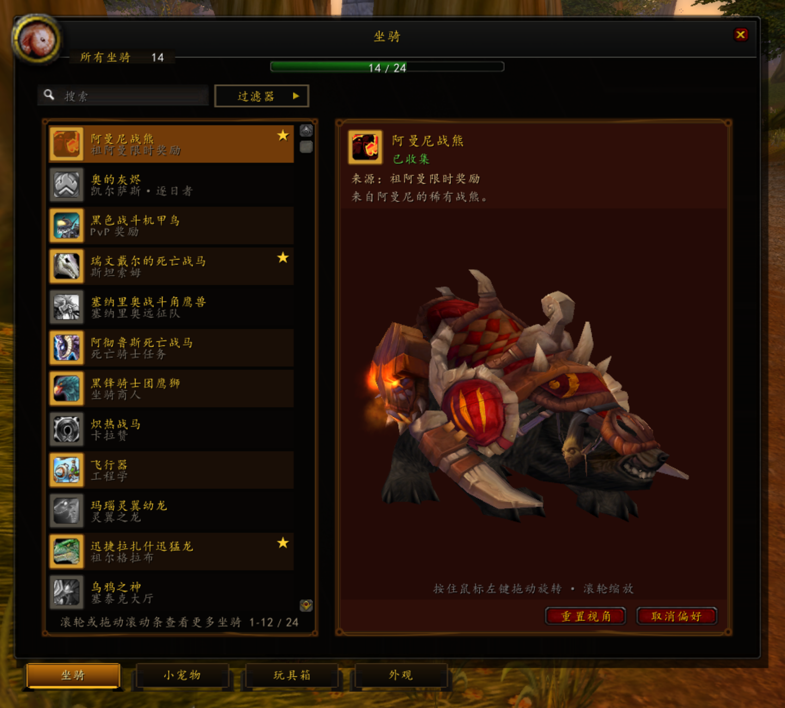
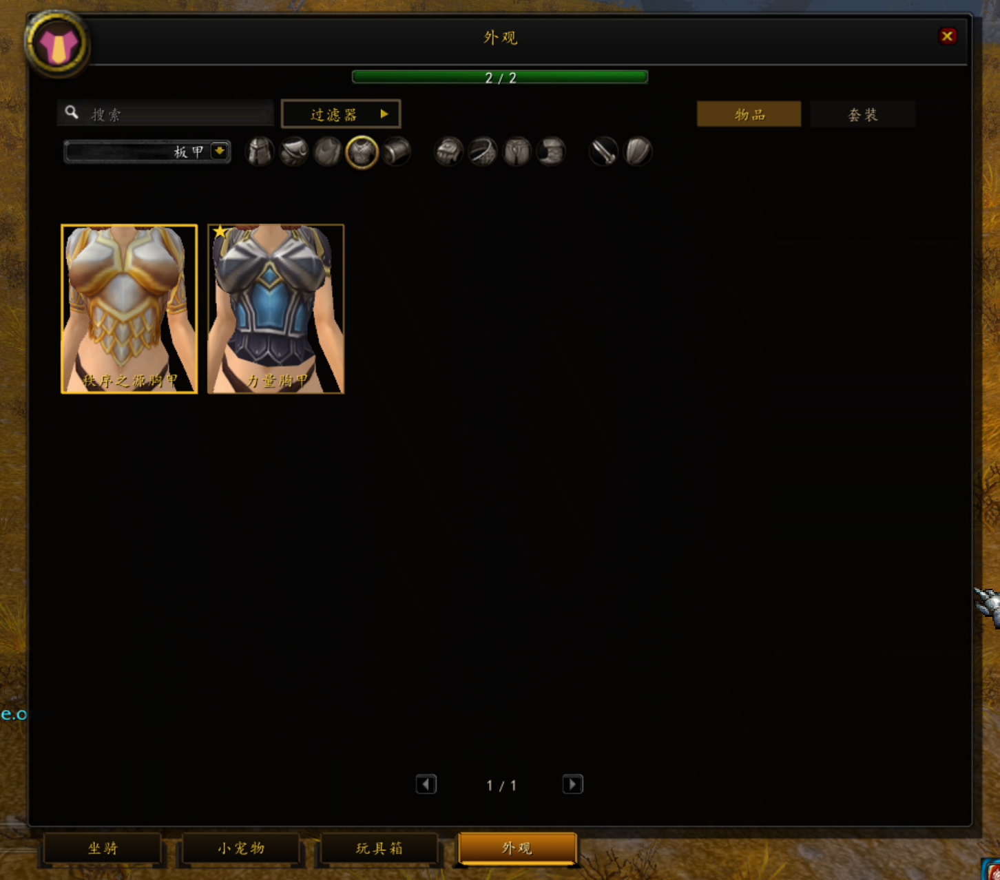

# SoloCollectionsPlatform

**魔兽世界 3.3.5a（WotLK 12340）账号级全功能收藏系统与军团风格幻化平台**

[](https://github.com/haha2345/SoloCollectionsPlatform/releases/tag/v0.3.2)
[](https://www.azerothcore.org/)
[-GPL--3.0--or--later-green.svg)](https://www.gnu.org/licenses/gpl-3.0.html)
[-AGPL--3.0-blueviolet.svg)](https://www.gnu.org/licenses/agpl-3.0.html)

---

## 📑 目录

- [1. 项目概述与核心价值](#1-项目概述与核心价值)
- [2. 系统架构与子模块划分](#2-系统架构与子模块划分)
- [3. 界面预览与展示](#3-界面预览与展示)
- [4. 安装与部署指南](#4-安装与部署指南)（也可直接看 [发布包说明](docs/RELEASE.zh-CN.md)）
- [5. 编译环境与构建方法](#5-编译环境与构建方法)
- [6. Agent 帮助文档（AI 智能体直接部署与操作指南）](#6-agent-帮助文档ai-智能体直接部署与操作指南)
- [7. 如何参与贡献](#7-如何参与贡献)
- [8. 未完成功能 TODO List 与路线图](#8-未完成功能-todo-list-与路线图)
- [9. 开源许可证与致谢](#9-开源许可证与致谢)

---

## 1. 项目概述与核心价值

### 1.1 项目是什么？
`SoloCollectionsPlatform` 是专为 **World of Warcraft 3.3.5a (Build 12340)** 打造的现代收藏系统与独立幻化试衣间综合平台。它将现代魔兽正式服（Legion/Dragonflight 风格）的账号级收藏体验带入 3.3.5a 经典版本，构建了一套**端云分离、服务端强权威、协议强类型校验、UI 响应极致流畅**的完整技术生态。

### 1.2 解决了什么痛点？
1. **传统 3.3.5 缺乏账号级收藏体系**：原生 3.3.5a 的坐骑和小宠物占用背包/法术书，没有全账号共享的外观衣柜，更无套装收集进度与进度条。
2. **传统幻化插件（如旧版 Transmog / SC1 / ALE）的架构缺陷**：
   - 依赖客户端计算与弱校验协议，容易引发客户端作弊、数据错乱与幽灵外观。
   - 大量占用内存、频繁创建销毁 Frame 导致卡顿与内存泄漏。
3. **原生 DressUpModel 镜头表现力贫乏**：3.3.5a 原生模型控件无法针对不同种族、性别、装备部位（如头盔、护肩、手套、鞋子）及极端尺寸武器进行特写构图与视口纠偏。
4. **缺乏现代工程化与自动化验收体系**：以往私服插件多为黑盒手工调试，缺少跨客户端并发测试、数据一致性验证工具链。

### 1.3 核心技术指标
- **19,146 条 Canonical 规范目录**：包含 281 个坐骑、201 个小宠物、9 个已审核玩具、18,190 个物品外观与 465 套经典套装；公开武器展示候选达 3,690 条（3,541 处于 `READY`）。
- **SC2 二进制分片同步协议**：支持全量快照分片下发、增量 Revision 版本校验与失败立即安全闭环（Fail-closed）。
- **180 个种族/性别/部位特写镜头 Profile**：结合可选的 32 位 x86 SoloCam 注入扩展，实现毫米级视口居中与特写。
- **全自动化后台无侵入验收框架**：基于 `PostMessage` + `PrintWindow` + `SavedVariables` + `Server.log` 实现跨多客户端的端到端无人值守验收。

---

## 2. 系统架构与子模块划分

本项目采用多模块工作区架构，各子系统边界分明：

```text
SoloCollectionsPlatform (平台工作区)
├── SoloCollections/               # 客户端 AddOn、目录生成器、SC2 协议规范、SoloCam 镜头扩展
│   ├── addon/SoloCollections/      # 3.3.5a Lua/FrameXML 插件源码（收藏手册 + 独立幻化室）
│   ├── client-extension/SoloCam/   # 32 位 C++ 客户端镜头 DLL 注入扩展源码
│   ├── tools/collections/          # Python 目录规范生成器、Schema 校验与导出工具
│   └── docs/                       # 架构设计、协议规范、镜头参数与验收记录
│
├── mod-solo-collections/           # AzerothCore C++ 服务端权威核心模块
│   ├── src/                        # C++ 业务逻辑、Provider 注册、SC2 协议收发、幻化核心
│   ├── data/sql/                   # 数据库 Migration 与账号级数据表结构
│   └── conf/                       # 服务端配置模板 mod_solo_collections.conf.dist
│
├── SoloClientSuite/                # 客户端全套 UI 集成套件（DragonUI、ClassicAPI、NewEra 等）
│   ├── Interface/AddOns/           # 依赖解耦的 AddOns 集合
│   └── tools/                      # 套件打包、锁文件验证与发布脚本
│
└── _work/                          # 自动化验收框架、基线审计与历史回溯
    └── qa-framework/               # 多客户端后台并发端到端验收套件
```

### 数据流与权威边界图

```text
       +-------------------------------------------------------+
       |                  catalog/ 原始目录清单                 |
       +-------------------------------------------------------+
                     │                                   │
                     ▼                                   ▼
+------------------------------------+  +------------------------------------+
|  AddOn 生成数据 (Lua 静态表)        |  |  C++ 生成代码 (Include .inc 表)    |
|  addon/SoloCollections/Data/       |  |  mod-solo-collections/src/         |
+------------------------------------+  +------------------------------------+
                     │                                   │
                     ▼                                   ▼
+------------------------------------+  SC2 协议  +------------------------------------+
|         WoW 3.3.5a 客户端           | <=======> |          AzerothCore 服务端        |
|  - 纯展示与交互 (FrameXML)         | (分片/增量)|  - 唯一权威 (C++ Backend)          |
|  - 发送操作意图 (typeId/actionId)  |           |  - MySQL 数据持久化 (characters 库) |
|  - 拦截未解锁/不兼容操作           |           |  - 动作最终授权与计价扣费          |
+------------------------------------+           +------------------------------------+
```

---

## 3. 界面预览与展示

*(注：以下预留了项目截图的占位位置，实际使用中可直接替换或补充相应图片)*

### 3.1 收藏手册（Collections Journal）

| 坐骑收藏页 (Mounts) | 非战斗小宠物页 (Companions) |
| :---: | :---: |
|  |  |
| *支持 3D 模型旋转、法术来源展示与快捷召唤* | *支持宠物分类、模型动作展示与多条件检索* |

| 物品外观页 (Appearances) | 经典套装页 (Sets) |
| :---: | :---: |
|  |  |
| *按护甲类型/武器种类精准筛选，真实品质高亮* | *全职业套装一览、收集进度追踪与全局试衣间* |

### 3.2 独立军团风格幻化室（Wardrobe Studio / Lab）

| 幻化试衣间与报价系统 | 外观方案管理与快捷撤销 |
| :---: | :---: |
|  |  |
| *单部位试穿、本地待定高亮、智能服务端报价* | *保存多套外观方案、一键载入、恢复原装外观* |

### 3.3 镜头微调与自动化验收

| SoloCam 局部特写对比 | QA 无人值守自动化测试 |
| :---: | :---: |
|  |  |
| *头部/护肩/手套/武器独立构图纠偏* | *三客户端并发、后台无焦点注入、端到端交叉验证* |

---

## 4. 安装与部署指南

### 4.1 快速部署环境要求
- **服务端**：AzerothCore WotLK (分支 `master` 或匹配版本)，MySQL 8.0/8.4+
- **客户端**：World of Warcraft 3.3.5a (Build 12340)，32 位 Windows 客户端

---

### 4.2 服务端模块部署（`mod-solo-collections`）

1. **拉取源码至 AzerothCore 模块目录**：
   ```powershell
   cd <AzerothCore_Root>/modules
   git clone https://github.com/haha2345/mod-solo-collections.git mod-solo-collections
   ```
   *确保路径结构为 `<AzerothCore_Root>/modules/mod-solo-collections/include.sh`*

2. **导入数据库结构与数据**：
   ```bash
   mysql -u root -p characters < modules/mod-solo-collections/data/sql/db-characters/base_solo_collections.sql
   mysql -u root -p world < modules/mod-solo-collections/data/sql/db-world/base_solo_collections_world.sql
   ```

3. **配置文件修改**：
   复制配置模板并按需编辑：
   ```powershell
   cp <AzerothCore_Root>/modules/mod-solo-collections/conf/mod_solo_collections.conf.dist <Runtime_Dir>/etc/mod_solo_collections.conf
   ```
   **核心配置建议**：
   ```ini
   SoloCollections.Enable = 1
   SoloCollections.Backend = "Cpp"            # 必须为 Cpp，确保服务端唯一权威
   SoloCollections.Transmog.Enable = 1        # 启用幻化功能
   SoloCollections.Transmog.CostModifier = 1.0 # 幻化费用倍率
   ```

---

### 4.3 客户端插件部署（`SoloCollections`）

1. **复制插件到客户端**：
   将 `SoloCollections/addon/SoloCollections` 目录完整拷贝到魔兽客户端的 `Interface/AddOns/` 目录中：
   ```text
   World of Warcraft/
   └── Interface/
       └── AddOns/
           └── SoloCollections/
               ├── SoloCollections.toc
               ├── SoloCollections.lua
               ├── Core/
               ├── Data/
               └── UI/
   ```

2. **（可选）部署 SoloCam 镜头增强模块**：
   若需开启极致特写镜头，将编译生成的 `SoloCam.dll` 放置在客户端根目录下，配合项目配套的注入器或引导器使用。

3. **游戏内指令验证**：
   - `/sc` 或 `/collections`：打开全功能收藏手册。
   - `/tmog` 或 `/幻化`：打开独立军团风格幻化室。
   - `/sc reset`：重置本地 UI 布局与筛选记忆。

---

## 5. 编译环境与构建方法

### 5.1 服务端编译（C++）

#### 依赖环境
- **Windows**：Windows 10/11，Visual Studio 2022（需勾选 **Desktop development with C++**），CMake 3.27+，Boost 1.78+，OpenSSL 3.x，MySQL Connector 8.0/8.4。
- **Linux**：Ubuntu 22.04 LTS+，`build-essential`，`cmake`，`libboost-all-dev`，`libssl-dev`，`libmysqlclient-dev`，`clang` 或 `gcc-11+`。

#### 编译步骤
```powershell
# 1. 生成版本元数据 (保证 AddOn 与 C++ 模块 Hash 严格匹配)
& .\SoloCollections\tools\release\New-SoloCollectionsBuildInfo.ps1 `
  -AddonRoot .\SoloCollections `
  -ModuleRoot .\mod-solo-collections `
  -CoreRoot <AzerothCore_Root> `
  -CoreBuildRoot <AzerothCore_Build_Dir>

# 2. CMake 配置与编译
cd <AzerothCore_Build_Dir>
cmake -B . -S <AzerothCore_Root> -DMODULES=static -DCMAKE_BUILD_TYPE=RelWithDebInfo
cmake --build . --config RelWithDebInfo --target worldserver -j 8
```

---

### 5.2 目录生成工具（Python）

修改或增补 `catalog/` 下的原始 YAML/JSON 数据后，运行工具重新生成 Lua 和 C++ 文件：

```powershell
# 需要 Python 3.10+
cd .\SoloCollections\tools\collections
python build_catalog.py --verify-all
python export_addon_lua.py --output-dir ..\..\addon\SoloCollections\Data\Generated
python export_server_inc.py --output-dir ..\..\..\mod-solo-collections\src\generated
```

---

### 5.3 镜头扩展编译（SoloCam C++）

使用 Visual Studio 打开 `SoloCollections/client-extension/SoloCam/SoloCam.sln`：
- **目标平台**：`Release` | `x86` (32位 MSVC)
- **输出产物**：`SoloCam.dll`

---

## 6. Agent 帮助文档（AI 智能体直接部署与操作指南）

> **💡 给 Coding Agent（Claude, Codex, GPT 等）的快速指引**：
> 本节为你提供自动化读写、调试、自检与安全部署本项目的标准化上下文。

### 6.1 核心纪律与设计红线（CRITICAL RULES）
1. **服务端唯一权威**：任何收藏解锁（`IsCollected`）、幻化写入、消耗金币、使用道具的动作，权限永远在 `mod-solo-collections`（C++）。**严禁**在客户端 Lua 中伪造或绕过验证逻辑。
2. **禁止直接修改 Generated 产物**：`Data/Generated/*.lua` 和 `src/generated/*.inc` 是编译生成的代码，手工改动会被覆写。必须通过修改 `catalog/` 源数据并运行生成脚本更新。
3. **不要在生产提交硬编码路径**：绝对不能将带有开发机特定的绝对路径（如 `D:\Games\...` 或 `F:\1_projects\...`）写入公共源码。
4. **Git 分支边界**：
   - `main`：稳定上线版本（当前不包含未成熟的玩具箱与头衔页）。
   - `feat/deferred-toy-box`：玩具箱延期开发分支。
   - `feat/deferred-title-journal`：头衔管理页延期开发分支。

---

### 6.2 Agent 一键部署与热重载脚本示例（PowerShell）

当你在本地为用户调试代码后，使用以下脚本将改动安全同向推送到测试客户端：

```powershell
# Agent 快速同步 AddOn 到本地客户端脚本
$SourceAddon = "F:\1_projects\wow_projects\SoloCollectionsPlatform\SoloCollections\addon\SoloCollections"
$ClientAddon = "D:\Games\wow335\World of Warcraft11\Interface\AddOns\SoloCollections"

if ((Test-Path $SourceAddon) -and (Test-Path $ClientAddon)) {
    Write-Host "[Agent Deploy] 同步 AddOn 源码到客户端..." -ForegroundColor Cyan
    & robocopy $SourceAddon $ClientAddon /MIR /NFL /NDL /NJH /NJS /NC /NS
    if ($LASTEXITCODE -lt 8) {
        Write-Host "[Agent Deploy] 部署成功！可在客户端内输入 /reload 立即生效。" -ForegroundColor Green
    } else {
        Write-Error "[Agent Deploy] Robocopy 失败，错误码: $LASTEXITCODE"
    }
} else {
    Write-Warning "[Agent Deploy] 目标路径不存在，请检查路径配置。"
}
```

---

### 6.3 自动化 QA 验收测试执行指引

项目内置全自动化验收套件位于 `_work/qa-framework/`。

```powershell
# 执行端到端完整验收测试 (无需手动切换游戏窗口，全程后台执行)
cd F:\1_projects\wow_projects\SoloCollectionsPlatform\_work\qa-framework
.\Run-Acceptance.ps1 -Suite suites/transmog.lua
```

- **三路交叉验证原理**：
  1. `PostMessage` 发送无焦点后台按键/聊天指令。
  2. 游戏内 `SoloCollectionsQaRunner` 执行异步测试步骤并存入 `SavedVariables`。
  3. 编排器读取 `worldserver` 的 `Server.log` 增量与 MySQL `characters` 数据库做落库比对。

---

### 6.4 典型故障排查决策树（Troubleshooting Matrix）

| 异常现象 | 可能原因 | 排查与修复方案 |
| :--- | :--- | :--- |
| **打开界面显示“服务尚未就绪/SC2断开”** | 1. C++ 模块未启用<br>2. 协议版本/Hash 不匹配 | 1. 检查 `worldserver.exe` 启动日志是否加载 `mod-solo-collections`<br>2. 重新运行 `New-SoloCollectionsBuildInfo.ps1` 保证两端 Hash 匹配 |
| **幻化室报价一直为 0 或无法应用** | 1. 装备槽位为空<br>2. 物品无法在该槽位应用<br>3. 角色金币不足 | 1. 确认当前角色对应槽位已穿戴有效装备<br>2. 检查服务端拦截原因（`INVALID_TARGET_SLOT` / `INSUFFICIENT_FUNDS`） |
| **物品特写镜头错位/黑屏** | 1. 缺少该种族/体型 Profile<br>2. 未加载 SoloCam 模块 | 1. 检查 `CameraProfiles.lua` 中是否有该模型的 fallback<br>2. 打开内置镜头工作台调整参数并导出 |
| **客户端报错 Lua Error: Attempt to call nil value** | 使用了高版本 WoW API (如 `C_MountJournal`) | 3.3.5a 必须使用原生 FrameXML 与 ClassicAPI 封装，严禁直接调用现代客户端专用 API |

---

## 7. 如何参与贡献

我们欢迎社区开发者共同完善 SoloCollections 生态！

### 7.1 贡献方向
1. **镜头参数校准（Camera Contributions）**：
   - 针对不同种族/性别/极端武器（长柄武器、法杖、双持巨剑）校准局部镜头。
   - 使用内置的镜头工作台调优，导出为 JSONL 提交。
2. **目录元数据审核（Catalog Curation）**：
   - 补全物品外观的获取来源标签（副本掉落、PVP 军装、专业制作、节日事件）。
   - 审核玩具箱（Toy Box）法术与物品兼容性。
3. **C++ 性能与安全性增强**：
   - 优化大规模账号并发下的快照同步吞吐。
   - 增强反作弊审计与异常操作告警机制。
4. **国际化与多语言（i18n）**：
   - 提供完整的英文、繁体中文等多语言本地化支持。

### 7.2 提交规范
- 提交信息遵循 [Conventional Commits](https://www.conventionalcommits.org/) 规范：
  - `feat(wardrobe): ...`（新特性）
  - `fix(camera): ...`（镜头或逻辑修复）
  - `perf(catalog): ...`（性能优化）
  - `docs(readme): ...`（文档变动）
- 涉及跨端协议改动时，必须在同一次 PR 中同步提供 C++ 端、Lua 端及 Schema 的配套改动。

---

## 8. 未完成功能 TODO List 与路线图

项目持续演进中，当前规划与未完成清单如下：

- [ ] **玩具箱完整上线（Toy Box）** *(延期分支: `feat/deferred-toy-box`)*
  - [ ] 接入服务端账号级玩具偏好持久化（替代本地 SavedVariables）
  - [ ] 扩充并审核 3.3.5a 经典版本的全部可用玩具（目前收录 9 条基线）
- [ ] **头衔管理系统（Title Journal）** *(延期分支: `feat/deferred-title-journal`)*
  - [ ] 实现从只读列表到点击直接激活/切换当前头衔
  - [ ] 服务端下发全账号头衔共享与同步机制
- [ ] **附魔视觉幻化（Illusion / Weapon Enchant Transmog）**
  - [ ] 接入武器发光与附魔特效外观选择与服务端预览
- [ ] **镜头 Profile 全覆盖与极端体型适配**
  - [ ] 针对侏儒、地精、牛头人以及高清自定义模型（HD Models）优化构图
  - [ ] 巨型双手武器和副手特殊物品视口边缘裁剪补偿
- [ ] **跨账号多角色共享隔离演练**
  - [ ] 编写同账号多角色并发登录与异账号数据绝对隔离的自动化压测套件
- [ ] **全球多语言本地化（Full English & Multi-locale Localization）**
  - [ ] 完成全界面字符串解耦，支持 enUS, zhTW, ruRU 等语言切换

---

## 9. 开源许可证与致谢

### 9.1 开源许可证
- **客户端 AddOn（`SoloCollections`）**：遵循 [GPL-3.0-or-later](https://www.gnu.org/licenses/gpl-3.0.html) 许可证开源。
- **服务端模块（`mod-solo-collections`）**：遵循 [AGPL-3.0](https://www.gnu.org/licenses/agpl-3.0.html) 许可证开源。
- *本项目严禁捆绑或闭源商业分发暴雪版权所有的私有美术资产与二进制补丁。*

### 9.2 致谢
- **[AzerothCore](https://www.azerothcore.org/)**：优秀的开源 3.3.5a 服务端架构与活跃的模块生态。
- **[DragonUI](https://github.com/) & ClassicAPI**：为 3.3.5a 带来的现代化 UI 基础框架与兼容层。
- **ezCollections**：在 3.3.5 时代早期探索收藏界面的先驱项目与思路启发。
- **所有参与测试与镜头贡献的维护者与玩家们**。

---

*SoloCollectionsPlatform © 2026. Crafted with passion for the World of Warcraft 3.3.5a Community.*
