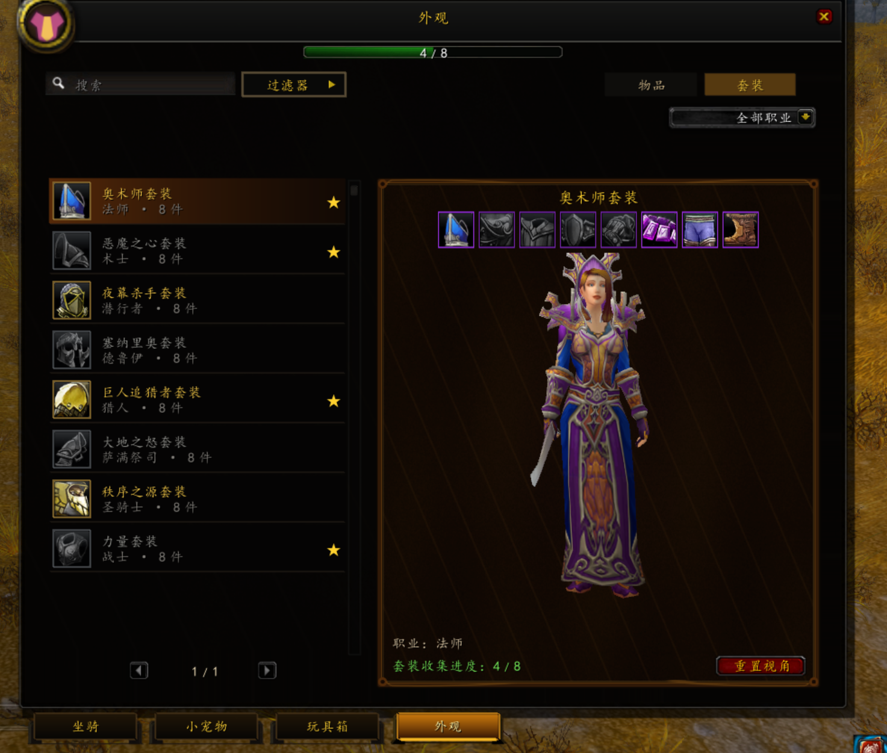
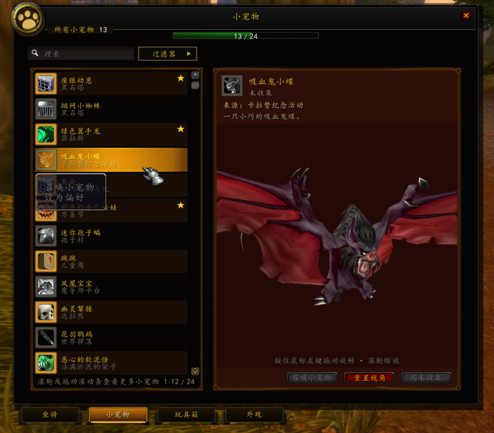
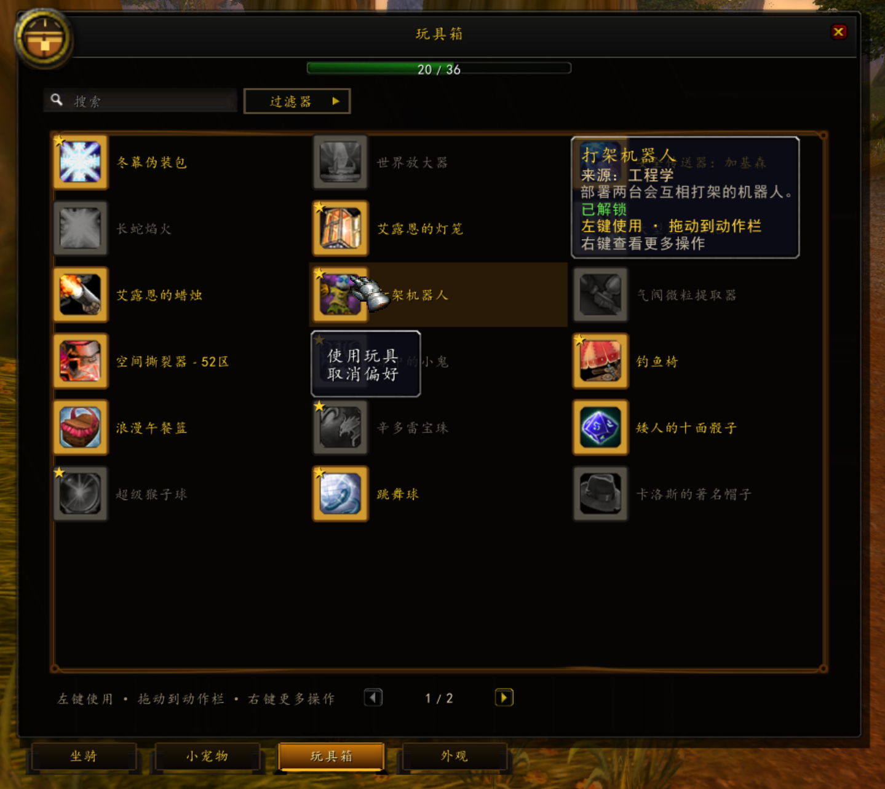
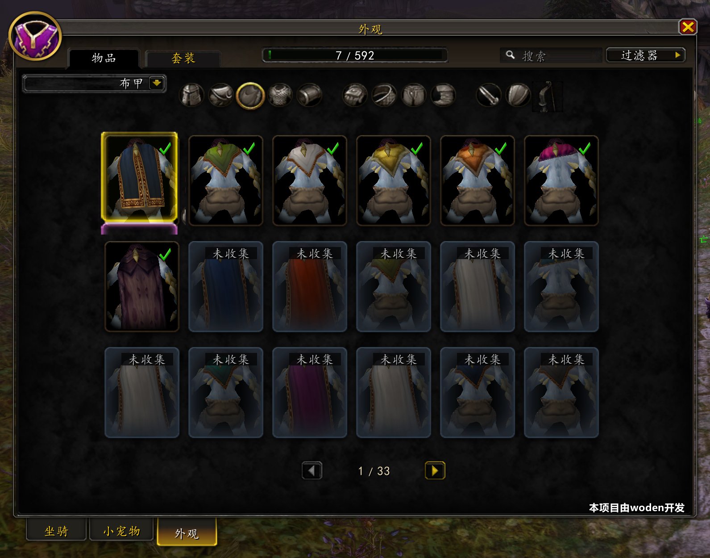

# SoloCollections：WoW 3.3.5a 收藏系统客户端

[English](README.en.md) · [下载 v0.2.0](https://github.com/haha2345/SoloCollections/releases/tag/v0.2.0) · [服务端核心模块](https://github.com/haha2345/mod-solo-collections) · [安装](docs/INSTALLATION.zh-CN.md) · [参与贡献](CONTRIBUTING.md)

SoloCollections 为 World of Warcraft 3.3.5a build 12340 提供接近正式服收藏手册的
客户端界面，集中展示坐骑、非战斗小宠物、玩具、装备外观和套装。这个仓库保存
AddOn、可复现的目录源数据、SC2 协议、目录生成工具，以及可选的 x86 SoloCam
镜头扩展。

账号收藏、权限校验、revision、同步和动作由独立仓库
[`mod-solo-collections`](https://github.com/haha2345/mod-solo-collections)
统一负责。生产环境必须使用 C++/SC2 后端；本仓库中的 ALE/SC1 文件只保留作
旧版迁移与协议参考，不能和 C++ 后端同时响应生产动作。

> 当前正式源码版本为 `v0.2.0`。请成套使用该标签的 AddOn、核心模块与
> `release-manifest.json`；旧 `v0.1.0` 是不兼容的 ALE/SC1 开发预览。



## 功能与当前状态

- 统一收藏窗口：坐骑、小宠物、玩具、外观物品和套装页面。
- 服务端权威的 SC2 握手、账号级收藏快照、增量 revision 和动作结果。
- 外观筛选、收藏进度、套装预览、收藏/可用状态和稳定目录 ID。
- 角色各部位镜头 profile，以及武器/副手独立模型的镜头工作台。
- 可复现目录：canonical source、审核决定、生成结果和 AddOn/C++ 双投影。
- 可选 SoloCam：只为精确匹配的 32 位 3.3.5a 客户端提供局部镜头能力。

当前生成目录包含 19,146 条 canonical 记录：281 个坐骑、201 个小宠物、
9 个已审核玩具、18,190 个外观和 465 套套装。武器展示基线有 3,690 个公开
候选，其中 3,541 个为 `READY`，149 个明确标为 `UNAVAILABLE`。这些数字来自
当前生成清单；修改目录后应重新生成，不要把 README 当作运行时数据库。

当前参考客户端已经完成本地验收，但物品页镜头仍有可贡献空间：不同种族、性别、
HD/自定义模型和极端比例武器可能出现过近、过远、偏移或裁切。详见
[镜头参数贡献指南](docs/CAMERA_CONTRIBUTIONS.md)。

## 界面截图

| 坐骑 | 非战斗小宠物 |
| --- | --- |
|  |  |

| 玩具箱 | 物品外观 |
| --- | --- |
|  |  |

## 两个代码仓库

| 仓库 | 职责 | 许可证 |
| --- | --- | --- |
| [`SoloCollections`](https://github.com/haha2345/SoloCollections) | 3.3.5a AddOn、目录源、SC2 schema、生成工具、SoloCam | GPL-3.0-or-later |
| [`mod-solo-collections`](https://github.com/haha2345/mod-solo-collections) | AzerothCore C++ 权威后端、账号收藏、SQL、服务端动作和兼容的幻化实现 | AGPL-3.0 |

客户端不会决定玩家是否拥有某项收藏。AddOn 只发送稳定的
`typeId/collectionId/actionId`；服务端执行授权、状态更新和最终动作。

## 运行环境

### 必需

- World of Warcraft 3.3.5a build 12340，32 位客户端；
- AddOn 接口版本 `30300`；
- AzerothCore WotLK 服务端；
- [`mod-solo-collections`](https://github.com/haha2345/mod-solo-collections)；
- AddOn 与模块使用匹配的 metadata、mapping hash 和 SC2 协议版本。

### 开发环境

- Git 2.40 或更新版本；
- Python 3.10，用于目录工具和契约检查；
- PowerShell 5.1 或 7；
- 编译 SoloCam 时需要 Windows 10/11、Visual Studio 2022、MSVC v143 x86
  工具链和 Windows SDK；
- 编译服务端模块时遵循
  [AzerothCore Windows requirements](https://www.azerothcore.org/wiki/windows-requirements)
  或对应平台的官方构建文档。

AddOn 本身使用 WoW 3.3.5 的 Lua 5.1/FrameXML API，无需编译。不能直接使用
Retail 的 `C_MountJournal`、`SetAtlas` 或 `ModelScene`。

## 最快配置方法

### 1. 获取匹配版本

```powershell
git clone --branch v0.2.0 https://github.com/haha2345/SoloCollections.git
git clone --branch v0.2.0 https://github.com/haha2345/mod-solo-collections.git
```

普通安装者可以直接下载
[`SoloCollections-v0.2.0-unified-source.zip`](https://github.com/haha2345/SoloCollections/releases/tag/v0.2.0)，
按包内 `README.zh-CN.md` 操作。详见
[发布包使用说明](docs/RELEASE_USAGE.zh-CN.md)。

### 2. 安装并编译服务端模块

把模块放到 AzerothCore 源码树中：

```text
<AzerothCore>/modules/mod-solo-collections/
```

重新运行 CMake，使用 `MODULES=static` 编译 `authserver` 和 `worldserver`。
复制 `conf/transmog.conf.dist` 到运行时配置目录，并在生产收藏后端中设置：

```ini
SoloCollections.Backend = Cpp
SoloCollections.Preview.Enabled = 1
```

完整命令、SQL 和启动检查见模块仓库的
[中文 README](https://github.com/haha2345/mod-solo-collections#readme)。

### 3. 安装 AddOn

复制整个目录：

```text
SoloCollections/addon/SoloCollections
    -> <WoW>/Interface/AddOns/SoloCollections
```

最终必须存在：

```text
<WoW>/Interface/AddOns/SoloCollections/SoloCollections.toc
```

### 4. 登录检查

启动服务端后应看到 `event=startup_versions` 和
`event=schema_check result=ready`。管理员在游戏中执行：

```text
.solocollections status
```

客户端打开收藏窗口后，应完成 SC2 握手并进入权威状态。若 metadata 或资源版本
不匹配，预览必须明确不可用，不能由客户端绕过。

详细安装、数据库和回滚步骤见[安装指南](docs/INSTALLATION.zh-CN.md)。

## 可选客户端镜头扩展

不安装 SoloCam 时，收藏状态、目录和大部分 UI 仍可运行；局部身体镜头和部分
独立武器展示会退回原生能力或显示明确不可用。

SoloCam 只支持 x86 WoW 3.3.5a build 12340，并锁定原始 `Wow.exe` SHA-256：

```text
AA63A5750D60EF16746C686B3D5E26876D98953EAB08B1C026CD0FAF78E88CB8
```

补丁器只创建副本，不覆盖原始 EXE。哈希不同必须停止。仓库和源码发布不包含
`Wow.exe`、已补丁 EXE、MPQ、DBC、M2、SKIN、BLP 或其他客户端提取资源。
构建和回滚见 [SoloCam 说明](client-extension/SoloCam/README.md) 与
[MPQ 自建指南](docs/BUILD_MPQ.zh-CN.md)。

## 构建与检查

| 内容 | 命令或入口 |
| --- | --- |
| AddOn | 无需编译，复制 `addon/SoloCollections` |
| Python 依赖 | `python -m pip install -r client-extension/SoloCam/requirements-dev.txt` |
| AddOn/目录检查 | `python -m unittest discover -s tools/collections/tests -p "test_*.py"` |
| SoloCam portable 检查 | `python -m unittest discover -s client-extension/SoloCam/tests -p "test_*.py"` |
| SoloCam x86 DLL | `client-extension/SoloCam/scripts/build.ps1` |
| 目录生成 | `tools/catalog/generate_catalog.py`，需要合法取得的外部 evidence 输入 |
| 统一源码发布包 | `tools/release/build_unified_release.py` |

完整依赖、环境变量、产物位置和目录生成边界见
[编译与开发指南](docs/BUILDING.zh-CN.md)。

## 文档导航

- [v0.2.0 发布包怎么使用](docs/RELEASE_USAGE.zh-CN.md)
- [完整安装与回滚](docs/INSTALLATION.zh-CN.md)
- [开发、编译和生成](docs/BUILDING.zh-CN.md)
- [开发流程与仓库结构](docs/DEVELOPMENT.md)
- [当前源码状态与已知限制](docs/STATUS.md)
- [镜头参数贡献指南](docs/CAMERA_CONTRIBUTIONS.md)
- [Agent 继续开发指南](docs/AGENT_DEVELOPMENT.md)
- [架构文档索引](docs/architecture/README.md)
- [SC2 协议](docs/protocol/sc2-wire-v1.md)
- [资源与公开边界](docs/ASSETS.md)
- [许可证说明](docs/LICENSING.md)
- [下载与版本匹配](docs/DOWNLOADS.md)

## 欢迎贡献

欢迎提交 Lua、C++、Python、目录审核、文档、兼容性和镜头参数。尤其欢迎：

- 新种族、性别和自定义模型的九部位身体镜头 profile；
- 武器 family、共享模型和单件异常的镜头参数；
- 英文界面与其他 locale 改进；
- 目录来源审核、性能改进和 SC2 兼容性修复；
- 可复现的客户端截图与失败样本，不包含受版权保护的游戏资源。

Fork 后从 `main` 建立功能分支，一次 PR 只解决一个问题。镜头 PR 应包含目标
种族/性别/部位或武器身份、客户端 build/哈希、修改前后截图、JSONL 导出和参数
选择理由。详见[贡献指南](CONTRIBUTING.md)。

## 使用 Agent 继续开发

两个仓库都提供根目录 `AGENTS.md`，并有一份面向人的
[Agent 开发指南](docs/AGENT_DEVELOPMENT.md)。推荐把两个仓库克隆为同级目录，
让 Agent 先阅读这些文件，再只修改一个明确范围。不要让 Agent 自动下载客户端
资源、修改真实数据库、覆盖游戏目录或把本地运行输出提交到 Git。

可直接使用这样的任务描述：

```text
先阅读 AGENTS.md、docs/DEVELOPMENT.md 和 docs/CAMERA_CONTRIBUTIONS.md。
只处理 <种族/性别/部位或武器身份> 的镜头问题。
保留服务端权威和 SC2 协议边界，不提交客户端二进制或提取素材。
给出最小代码/参数修改、需要我在真实 3.3.5a 客户端执行的验收步骤，
并更新相关文档。
```

## 许可证与声明

本仓库自有代码采用 **GNU GPL-3.0-or-later**，见 [LICENSE](LICENSE)。
第三方代码和资源见 [THIRD_PARTY_NOTICES.md](THIRD_PARTY_NOTICES.md)。
客户端提取素材、游戏二进制和独立模块不自动获得本仓库许可证。

本项目是非官方社区兼容性项目，与 Blizzard Entertainment 或 AzerothCore
官方无隶属或背书关系。请只使用自己有权使用的客户端、服务端和资源。
