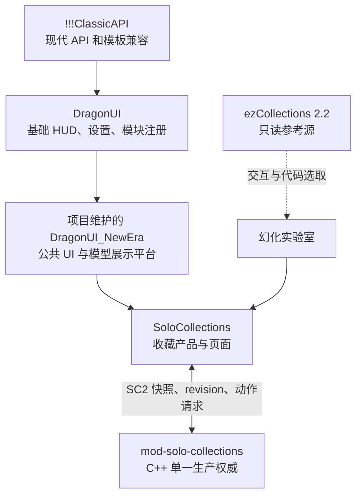

# DragonUI 客户端平台与 SoloCollections UI 迁移实施方案

> **执行方式：** 按工作区 `AGENTS.md` 使用小步敏捷迭代；不主动引入 TDD、子代理开发、独立代码审查或独立验证阶段。每个视觉阶段都把源码检查、客户端运行和真实视觉验收分别记录。

**目标：** 把 `!!!ClassicAPI`、DragonUI、项目维护的 DragonUI_NewEra 分支和 SoloCollections 组合成可扩展的 WoW 3.3.5a 客户端 UI 平台；最终视觉合同是 DragonUI_NewEra 只提供顶层金属外框、标题栏、肖像和关闭按钮，收藏内页与幻化工作流按 ezCollections 2.2 的页面树、尺寸、交互和本地授权素材重建。

**架构：** `!!!ClassicAPI` 只拥有现代 API 兼容层，DragonUI 只拥有基础 HUD、设置和模块注册，DragonUI_NewEra 提供顶层 Chrome 与稳定模型 presenter，SoloCollections 继续拥有收藏产品、目录、SC2 客户端和页面状态。ezCollections 的 UI 树、FrameXML 布局、交互和素材作为本地集成皮肤母版，由 namespaced 适配层连接 SoloCollections 数据，不加载它的服务端 Lua、消息协议或 `C_Transmog*` 生产逻辑；C++/SC2 后端仍是收藏、授权、费用、revision、持久化和动作结果的唯一权威。

**技术栈：** WoW 3.3.5a build 12340、Lua 5.1、FrameXML、`!!!ClassicAPI` 1.23、DragonUI 2.5、DragonUI_NewEra、SoloCollections SC2、可选 SoloCam、PowerShell 7、Python 3.10。

**状态：** Tasks 0-12 已达到 `IMPLEMENTED_LOCAL`，并完成真实客户端冒烟观察，但未达到 `VISUAL_ACCEPTED`。2026-08-11 实机反馈否决了“所有内页都使用 NewEra 通用组件”的视觉方向，Tasks 13-20 作为纠偏阶段，改为“NewEra 外框 + ezCollections 内页”；Tasks 13-19 已完成失败基线、来源与完整素材锁定、双尺寸外框、五类收藏内页与 WardrobeFrame 幻化页迁移。Tasks 0-12 保留为历史实现与回退点，不将其实机可运行误写为最终视觉通过。既有证据见 [`tasks9-12-implemented-local.md`](../evidence/dragonui-migration/tasks9-12-implemented-local.md)、[`client-runtime-observed-20260811.md`](../evidence/dragonui-migration/client-runtime-observed-20260811.md) 与 Tasks 13-19 各项证据。

---

## 1. 已确认的产品决策

1. 允许把 DragonUI、DragonUI_NewEra、`!!!ClassicAPI` 的代码和美术资源直接纳入集成客户端项目。
2. DragonUI 是整套客户端的基础 UI；`!!!ClassicAPI` 是未来移植现代插件的底层兼容包。
3. DragonUI_NewEra 是项目顶层窗口 Chrome 和模型 presenter 平台；SoloCollections 内部页面不再强制使用它的通用 Inset、卡片和标签视觉。
4. SoloCollections 的 C++/SC2 后端方向保留，并继续作为收藏系统的核心竞争力和唯一生产权威。
5. 第一阶段只替换收藏窗口外壳和公共组件，不修改 SC2、收藏逻辑、模型桥和幻化动作。
6. 第一阶段之后允许替换或重构现有模型桥、相机配置和异步 `TryOn` 状态机；旧路线只作为迁移期 A/B 与回退实现。
7. 模型加载、generation 和 provider 继续复用 NewEra/SoloCollections presenter；可见的模型背景、槽位、控制和页面几何按 ezCollections 母版呈现。
8. ezCollections 的收藏日志、衣柜和幻化页面作为实际 UI 母版进入本地集成实现；“外观收藏”和“幻化实验室”共享其 WardrobeCollectionFrame 视觉树，但保持独立产品状态。
9. “幻化实验室”必须沿用 ezCollections `WardrobeFrame` 的 300px 角色编辑区与 662px 候选区；实验状态使用低干扰标题/状态文字，不能用独立三栏工作台替代，也不能把本地试穿误报为服务端已应用。
10. 现有 11 个槽位保持为 `HEAD`、`SHOULDER`、`BACK`、`CHEST`、`WRIST`、`HANDS`、`WAIST`、`LEGS`、`FEET`、`MAINHAND`、`OFFHAND`；不增加衬衣和战袍。

## 2. 已核对的上游快照

| 组件 | 当前快照 | 在本方案中的角色 |
| --- | --- | --- |
| DragonUI | `9c7e5b189f438391e3de8731b4fc62fc2a0f0839`，TOC 2.5 | 基础 HUD、AceDB profile、选项、模块注册、编辑模式 |
| DragonUI_NewEra | `8f3d1007952abd532c6d5b736b7d43d30a9b4719` | 公共 Chrome、NineSlice、Atlas、组件、面板和模型展示平台 |
| `!!!ClassicAPI` | `1ffaa484f62f225052de69dd82d97f78bf723fd7`，TOC 1.23 | 现代 API、Mixin、C_Timer、C_Texture、C_* 与模板兼容层 |
| ezCollections | 本地 2.2 快照 | 衣柜、试衣、待应用、套装和幻化交互参考 |
| SoloCollections | `df7e873059fcaeb8c3af6496b3c49b5a1f5fd818`，v0.2.0 | 收藏产品、目录、SC2 客户端、页面状态、动作桥 |

实现时在集成仓库保存机器可读的 upstream lock；不得用“最新版”代替 commit、版本和文件 Hash。
当前 DragonUI_NewEra 本地审计目录是排除了大部分 `Textures/`、`Sounds/` 和 `Libs/` 的 sparse checkout，只能用于源码分析；Task 1 必须从该 commit 获取完整 Git tree，不能把 sparse 目录误当作完整资源包复制。

## 3. 目标系统所有权



### 3.1 `!!!ClassicAPI`

只负责兼容现代客户端 API 和模板：

- `C_Timer`、`C_Texture`、`Mixin`、`CreateFromMixins`；
- `C_Container`、`C_Item`、`C_Spell`、`C_SpellBook`、`C_Map` 等兼容命名空间；
- `NineSlice`、搜索框、Dropdown 等公共模板；
- 新移植插件可复用的通用兼容行为。

禁止加入：

- SoloCollections 收藏状态；
- DragonUI 风格设置；
- 任意页面业务逻辑；
- 服务器通信或 SC2。

上游没有提供的符号放在 DragonUI_NewEra 的 `compat/`，以 capability guard 补齐；不要反向污染 ClassicAPI vendor 目录。

### 3.2 DragonUI

只负责整套客户端的基础 UI 平台：

- HUD、动作条、单位框体、小地图、背包等基础模块；
- `DragonUIDB` profile、布局预设和编辑模式；
- `ModuleRegistry` 作为所有前端模块启停的唯一注册表；
- `DragonUI_Options` 作为统一设置入口。

DragonUI 不拥有收藏目录、收藏状态、幻化草稿或模型 identity。

### 3.3 项目维护的 DragonUI_NewEra

它是 DragonUI 上方的“现代面板平台”，不再让其他项目直接访问内部 `NE.*` 表。它需要提供版本化 Public API：

```lua
DragonUI_NewEra.Public = {
    API_VERSION = 1,
    Theme = {},
    Chrome = {},
    Components = {},
    Modules = {},
    Model = {},
    Callbacks = {},
}
```

公共职责：

- Panel Chrome、NineSlice、Texture/Atlas、Portrait、Tabs；
- 搜索、筛选、按钮、滚动条、ItemButton、Inset、Grid；
- 面板注册、DragonUI ModuleRegistry 适配和统一启停；
- 大型模型窗口的背景、控制条、拖动、旋转、平移、滚轮缩放；
- 可替换的模型 presenter 策略和 generation 生命周期；
- capability 报告与兼容层覆盖报告。

### 3.4 SoloCollections

继续负责：

- 目录、搜索、过滤、分页和产品状态；
- SC2 握手、快照、revision、增量和动作回调；
- 坐骑、宠物、玩具、外观、套装和头衔页面；
- 权威拥有状态的客户端投影；
- 本地偏好、当前选择、预览草稿等非权威 UI 状态；
- 向 DragonUI_NewEra Public API 提交页面、组件和模型展示请求。

禁止让 DragonUI/DragonUI_NewEra 的 SavedVariables 充当收藏权威。

### 3.5 mod-solo-collections

保持生产单一写入者，继续拥有：

- 账号收藏状态和数据库；
- 权限、费用、revision 和动作结果；
- 单件外观、套装和未来多槽外观方案的原子应用；
- 客户端不得自行决定的全部业务规则。

阶段 0 至阶段 6 不修改 SC2。未来“保存整套外观方案”如需要新协议，单独建立跨仓库阶段和分支。

## 4. 集成仓库与运行目录

现有 `SoloCollections` 公共源码仓库有明确的 BLP/客户端资源发布边界。完整 DragonUI 美术资源应进入新的集成客户端仓库，而不是混入现有 unified-source 发布物。

建议新建同级仓库：

```text
SoloCollectionsPlatform/
├─ SoloCollections/                 现有 AddOn/目录/协议源码权威
├─ mod-solo-collections/             现有 C++ 后端权威
└─ SoloClientSuite/                  新增：集成客户端 UI 与安装包权威
   ├─ Interface/AddOns/
   │  ├─ !!!ClassicAPI/
   │  ├─ DragonUI/
   │  ├─ DragonUI_Options/
   │  ├─ DragonUI_NewEra/
   │  └─ SoloCollections/            由同步脚本从 sibling repo 生成
   ├─ upstream/
   │  ├─ suite-lock.json
   │  ├─ DragonUI.NOTICE.md
   │  ├─ DragonUI_NewEra.NOTICE.md
   │  ├─ ClassicAPI.NOTICE.md
   │  └─ ezCollections-reference.json
   ├─ tools/
   │  ├─ Sync-Upstream.ps1
   │  ├─ Sync-SoloCollections.ps1
   │  ├─ Build-ClientSuite.ps1
   │  └─ Inspect-ClientSuiteLayout.ps1
   └─ docs/architecture/
      ├─ dependency-layers.md
      ├─ public-ui-api.md
      ├─ addon-load-order.md
      └─ update-and-rollback.md
```

这样用户拿到的是一个完整客户端 AddOns 套件，开发时仍保留各系统明确的源码权威。`Interface/AddOns/SoloCollections` 是构建产物，不作为第二份可手工编辑的源码。

## 5. AddOn 依赖和设置所有权

目标 TOC 依赖：

```text
!!!ClassicAPI                 无项目依赖
DragonUI                     独立加载
DragonUI_Options             OptionalDeps: DragonUI
DragonUI_NewEra              Dependencies: DragonUI, !!!ClassicAPI
SoloCollections              Dependencies: DragonUI_NewEra
```

SoloCollections 通过 DragonUI_NewEra 间接获得 DragonUI 和 ClassicAPI，避免 TOC 中重复声明三层依赖。

设置归属：

| 设置 | 保存位置 |
| --- | --- |
| SoloCollections 模块是否启用 | `DragonUIDB.profile.modules.solocollections.enabled` |
| DragonUI_NewEra 面板启停 | `DragonUIDB.profile.modules.ne_*.enabled` |
| 收藏搜索、过滤、偏好、选中标签 | `SoloCollectionsDB` |
| 实验室开关 | `SoloCollectionsDB.experimental` |
| 实验室待应用草稿 | 仅当前登录会话内存；关闭/切换时显式处理，不作为收藏持久化 |
| 服务端收藏/权限/revision | C++ 后端与 SC2 客户端状态，不进 SavedVariables |
| 窗口位置 | 统一使用 DragonUI_NewEra `FrameUtil.PersistWindowPosition` |

不得同时维护第二套 `SC.db.frame` 和 DragonUI 窗口位置；迁移一次后删除旧写入点。

## 6. DragonUI_NewEra Public API 合同

### 6.1 主题和纹理

拟新增：

```text
DragonUI_NewEra/public/API.lua
DragonUI_NewEra/public/Theme.lua
DragonUI_NewEra/public/Chrome.lua
DragonUI_NewEra/public/Components.lua
DragonUI_NewEra/public/Model.lua
DragonUI_NewEra/public/Callbacks.lua
```

最低 API：

```lua
Public.GetVersion()
Public.HasCapability(name)
Public.Theme:GetToken(name)
Public.Theme:GetTexture(name)
Public.Chrome:Apply(frame, options)
Public.Chrome:SetTitle(frame, title)
Public.Components:CreateInset(parent, options)
Public.Components:CreateBottomTab(parent, spec)
Public.Components:CreateSearchBox(parent, spec)
Public.Components:CreateFilterButton(parent, spec)
Public.Components:SkinButton(button, options)
Public.Components:SkinScrollbar(scrollbar, options)
Public.Modules:RegisterFeature(spec)
Public.Model:CreatePresenter(model, options)
Public.Model:AttachControls(model, options)
Public.Callbacks:Register(event, owner, callback)
Public.Callbacks:UnregisterOwner(owner)
```

SoloCollections 不得直接调用：

- `NE.panelchrome.*`；
- `NE.nineslice.*`；
- `NE.charpanel.*`；
- `NE.modules.registry`；
- `DragonUI.ModuleRegistry`；
- DragonUI_NewEra 模块私有纹理表。

### 6.2 模块注册合同

SoloCollections 注册：

```lua
Public.Modules:RegisterFeature({
    id = "solocollections",
    title = "Solo Collections",
    default = true,
    open = UI.ToggleJournal,
    close = UI.HideJournal,
    refresh = UI.RefreshActivePage,
})
```

Public API 负责把它适配到 DragonUI `ModuleRegistry`、选项页、QA 列表和重载门。SoloCollections 不复制 NewEra 的注册胶水。

### 6.3 模型 presenter 合同

```lua
local presenter = Public.Model:CreatePresenter(model, {
    kind = "CREATURE", -- CREATURE / DRESSUP / DISPLAY
    controls = "LARGE_PREVIEW",
    scheduler = "SHARED",
})

presenter:SetRecord(record, generation)
presenter:SetCameraProfile(profile)
presenter:ResetView()
presenter:Clear(generation)
presenter:SetVisible(visible)
presenter:Destroy()
```

presenter 策略：

| kind | 初始实现 | 目标 |
| --- | --- | --- |
| `CREATURE` | NewEra `PlayerModel:SetCreature` + 背景 + 控制条 | 坐骑、宠物和可解析 creature 模型 |
| `DRESSUP` | 当前 `SetUnit/TryOn` generation 流程包装后迁入平台 | 角色、装备部位和套装预览 |
| `DISPLAY` | 当前 SoloCam direct display bridge 作为首个 provider | 武器/副手；以后可以替换 provider 而不改页面 |

“允许替换旧模型桥”不等于立即删除有效能力。只有新 provider 覆盖未收集模型、九部位、套装、主手、副手和快速切换后，旧实现才能退出生产路径。

## 7. 收藏窗口最终页面结构

```text
SoloCollections 主窗口
├─ DragonUI_NewEra PortraitFrame Chrome
│  ├─ 圆形分类肖像
│  ├─ 当前页面标题
│  ├─ 收藏数量与进度
│  ├─ 搜索框与筛选按钮
│  └─ 现代关闭按钮
├─ 动态内容宿主
│  ├─ 坐骑
│  ├─ 宠物
│  ├─ 玩具
│  ├─ 外观收藏
│  │  ├─ 物品
│  │  └─ 套装
│  ├─ 幻化实验室（实验）
│  └─ 头衔
└─ DragonUI_NewEra 底部悬挂标签
```

Tasks 0-12 历史阶段使用 `920×793` 画布。实机证明该高度会让底部标签溢出屏幕；纠偏阶段采用 ezCollections 的标准高度 `606`，普通收藏日志宽 `703`，幻化工作台宽 `965`。切页只改变窗口宽度，不改变高度。

## 8. 统一状态语义

| 状态 | 权威来源 | 视觉/交互含义 |
| --- | --- | --- |
| `OWNED` | SC2 | 已拥有，可进入服务端动作检查 |
| `UNOWNED` | SC2 | 未拥有；允许预览不等于允许应用 |
| `UNKNOWN` | SC2 未就绪 | 显示“状态加载中”，禁止动作 |
| `FAVORITE` | 本地 SavedVariables | 仅排序/星标，不授权 |
| `SELECTED` | 页面 controller | 当前列表或卡片选择 |
| `PREVIEWING` | 模型 presenter | 只在客户端模型中试穿 |
| `DRAFT` | 幻化实验室本地草稿 | 尚未提交服务端 |
| `REQUESTING` | SC2 request | 禁止重复点击，显示进行中 |
| `APPLIED` | SC2 action result | 服务端确认本次动作成功 |
| `ACTIVE` | 服务端/原生当前状态 | 当前召唤、启用或装备效果 |
| `UNAVAILABLE` | capability/asset/provider | 明确说明缺失原因，不用占位成功 |
| `ERROR` | 模型/协议/动作结果 | 显示可诊断原因，保留回退入口 |

任何页面不得把 `PREVIEWING` 或 `DRAFT` 显示为 `OWNED`/`APPLIED`。

## 9. 幻化实验室交互设计（Tasks 13-20 覆盖版）

标签键：`TRANSMOG_LAB`；显示文字：`幻化实验室`；低干扰状态文字：`实验 / 本地草稿`。

```text
DragonUI_NewEra 顶层外框（965×606）
├─ 左侧 WardrobeTransmogFrame（300px）
│  ├─ 外观方案下拉框与保存入口
│  ├─ 294×488 DressUpModel
│  ├─ 围绕角色排列的 11 个槽位按钮
│  ├─ 清除待应用按钮
│  └─ 权威费用/状态与应用按钮
└─ 右侧 WardrobeCollectionFrame（662px）
   ├─ 物品 / 套装标签
   ├─ 搜索与来源过滤
   ├─ 3×6 外观模型卡或 2×4 套装卡
   └─ 分页、拥有状态、候选来源与空状态
```

### 9.1 初始测试范围

- 只支持现有 11 个槽位；
- 点击左侧槽位后，右侧切换对应类别；选择候选后立即在左侧模型本地试穿；
- 草稿按槽位保存 `appearanceId/sourceItemId/state`；
- 只有一个 dirty 槽位时，“应用”复用现有 SC2 type 13；
- 官方套装的现有应用继续复用 type 14；
- “保存整套”初期禁用，不能在客户端循环发送 11 个单槽动作伪装原子成功；
- 关闭窗口、切换方案或重载前必须处理未保存草稿；切换方案先确认，关闭窗口保留会话草稿但不持久化为权威状态；
- 费用只能由服务端返回，初始 UI 不自行计算。

### 9.2 直接复用与明确排除

本地集成允许复用 `Blizzard_Collections`、`Blizzard_MountCollection`、`Blizzard_PetCollection`、`Blizzard_ToyBox`、`Blizzard_Wardrobe`、`WardrobeOutfits` 的布局、模板、交互代码和所需素材。所有全局符号必须 namespaced；数据访问必须通过 SoloCollections adapter。

仍然排除：

- `C_Transmog*` 仿真层；
- ezCollections 插件消息协议；
- 混淆服务端 Lua；
- 商城、CDKey、体验模式和客户端解锁命令；
- Retail 独有槽位和 3.3.5 不存在的物品分类；
- 以客户端缓存作为收藏授权的逻辑。

## 10. 分阶段实施

### Task 0：建立实施基线和分支（已完成：`IMPLEMENTED_LOCAL`，2026-08-11）

**仓库与分支：**

- `SoloClientSuite`: `feat/bootstrap-ui-platform`
- `SoloCollections`: `feat/dragonui-collections-shell`
- `mod-solo-collections`: 本轮不建分支；只有未来 SC2/原子外观方案阶段才建 `feat/wardrobe-outfits-sc2`

**动作：**

1. 记录三个现有仓库的 commit、status 和 remote。
2. 创建 F: 盘内的完整、可回退源码快照；不包含真实客户端安装目录。
3. 在 `SoloClientSuite/upstream/suite-lock.json` 记录上游 URL、commit、TOC 版本、目录 Hash、同步日期和本地 patch 状态。
4. 为无明确许可证文件的来源记录用户授权范围与公开发布待复核状态。
5. 保存当前 SoloCollections 六张主要页面截图作为 before 基线。

**完成条件：** 只建立源码/证据基线，不部署客户端、不修改数据库、不推送远端。

**建议提交：** `chore: establish client UI platform baseline`

### Task 1：建立 SoloClientSuite 集成仓库（已完成：`IMPLEMENTED_LOCAL`，2026-08-11）

**创建：**

- `SoloClientSuite/README.md`
- `SoloClientSuite/AGENTS.md`
- `SoloClientSuite/upstream/suite-lock.json`
- `SoloClientSuite/tools/Sync-Upstream.ps1`
- `SoloClientSuite/tools/Sync-SoloCollections.ps1`
- `SoloClientSuite/tools/Build-ClientSuite.ps1`
- `SoloClientSuite/tools/Inspect-ClientSuiteLayout.ps1`
- `SoloClientSuite/docs/architecture/dependency-layers.md`
- `SoloClientSuite/docs/architecture/update-and-rollback.md`

**动作：**

1. 复制完整 `!!!ClassicAPI`、DragonUI、DragonUI_Options 和 DragonUI_NewEra 到 `Interface/AddOns`。
2. `Sync-SoloCollections.ps1` 从 sibling `SoloCollections/addon/SoloCollections` 生成运行副本。
3. 构建脚本拒绝找不到 `.toc`、路径多套一层或 commit/hash 不匹配的输入。
4. 构建输出写入仓库忽略的 `build/Interface/AddOns`。
5. 保留上游 notice、许可证和第三方说明；不把所有文件错误声明为 SoloCollections GPL。

**完成条件：** 构建输出包含五个正确的 AddOn 根目录，并可整体删除回退；不触碰真实客户端。

**建议提交：** `feat: add integrated client addon suite`

### Task 2：把 DragonUI_NewEra 固化为项目 UI 平台（已完成：`IMPLEMENTED_LOCAL`，2026-08-11）

**修改：**

- `DragonUI_NewEra/DragonUI_NewEra.toc`
- `DragonUI_NewEra/bootstrap.lua`
- `DragonUI_NewEra/core/Modules.lua`
- `DragonUI_NewEra/integration/Register.lua`

**创建：**

- `DragonUI_NewEra/public/API.lua`
- `DragonUI_NewEra/public/Theme.lua`
- `DragonUI_NewEra/public/Chrome.lua`
- `DragonUI_NewEra/public/Components.lua`
- `DragonUI_NewEra/public/Model.lua`
- `DragonUI_NewEra/public/Callbacks.lua`
- `DragonUI_NewEra/docs/PUBLIC_API.md`

**动作：**

1. Public API 在 core、assets 之后、业务 modules 之前加载。
2. 封装现有 `panelchrome`、`nineslice`、`texture`、`tabs`、`buttonskin`、`scrollbar` 和 `FrameUtil`。
3. 把 DragonUI `ModuleRegistry` 设为启停唯一入口；NewEra 自己的 registry 只负责 boot/依赖拓扑。
4. 一次性迁移旧 `DragonUIDB.profile.newera.modules.*` 到 `DragonUIDB.profile.modules.ne_*`，停止双写启停状态；`profile.newera` 只保留各面板内部设置。
5. 为 Public API 加 `API_VERSION` 和 capability 查询。
6. 任何上游内部改名只在 Public API 内适配，不让 SoloCollections 跟着改。

**完成条件：** 一个最小外部示例可只通过 `DragonUI_NewEra.Public` 创建现代窗口、Inset、标签和按钮。

**建议提交：** `feat: expose stable DragonUI NewEra public API`

### Task 3：接入 SoloCollections 平台适配层（已完成：`IMPLEMENTED_LOCAL`，2026-08-11）

**修改：**

- `addon/SoloCollections/SoloCollections.toc`
- `addon/SoloCollections/Core/Bootstrap.lua`
- `addon/SoloCollections/UI/Templates.lua`
- `addon/SoloCollections/UI/Launcher.lua`

**创建：**

- `addon/SoloCollections/Core/UIPlatform.lua`

**动作：**

1. TOC 添加 `## Dependencies: DragonUI_NewEra`。
2. 在生成数据与 UI 之前加载 `Core/UIPlatform.lua`。
3. `UIPlatform` 检查 Public API 版本和必需 capability；缺失时显示明确错误并停止创建窗口。
4. `Templates.lua` 暂时保留原函数名，但内部委托给 Public API，避免同一阶段重写所有页面。
5. 通过 `Public.Modules:RegisterFeature` 注册 SoloCollections。
6. 迁移窗口位置到 DragonUI_NewEra 持久化接口，并保留一次性 SavedVariables 迁移。

**完成条件：** 业务页面仍调用原 `UI.Create*` 接口，但视觉组件已来自平台；SC2 和 Catalog 文件没有变化。

**建议提交：** `refactor: route collection UI through DragonUI platform`

### Task 4：第一阶段整体替换主窗口外壳（已完成：`IMPLEMENTED_LOCAL`，2026-08-11）

**修改：**

- `addon/SoloCollections/UI/CollectionsFrame.lua`
- `addon/SoloCollections/UI/Templates.lua`
- `addon/SoloCollections/UI/Launcher.lua`

**动作：**

1. 保留当前 `920×793`、content host、五个生产页面和 Wardrobe 子标签。
2. 替换为 NewEra PortraitFrame Chrome、Rock 背景、金属 NineSlice、标题带和现代关闭按钮。
3. 替换搜索框、筛选按钮、进度条、收藏数量框和底部悬挂标签。
4. 不修改 `UI.SetMainTab` 的业务语义，不修改任何 `Bridge.*` 调用。
5. 保留临时 `uiShell = LEGACY/DRAGONUI` 开发开关；默认 `DRAGONUI`，用于截图对照和快速回退。
6. 页面内部现有边框先通过兼容 facade 统一换肤，不改变页面几何。

**完成条件：** 五个现有页面行为、数量、搜索、筛选和动作与基线一致；变化仅限外壳和公共控件。

**真实客户端观察点：** 1920×1080 与一个较低分辨率、默认/非默认 UI Scale、移动窗口、关闭重开、`/reload`。

**建议提交：** `feat: replace collection journal shell with DragonUI chrome`

### Task 5：增加“幻化实验室”独立标签和空页面（已完成：`IMPLEMENTED_LOCAL`，2026-08-11）

**修改：**

- `addon/SoloCollections/UI/CollectionsFrame.lua`
- `addon/SoloCollections/Core/Bootstrap.lua`

**创建：**

- `addon/SoloCollections/UI/WardrobeLab/Controller.lua`
- `addon/SoloCollections/UI/WardrobeLab/Layout.lua`

**动作：**

1. 在 `TAB_DEFINITIONS` 注册 `TRANSMOG_LAB`。
2. 显示“实验”角标和当前能力说明。
3. 增加 `SoloCollectionsDB.experimental.transmogLabEnabled`；开发构建默认开启，公开稳定构建默认关闭。
4. 空页面先展示计划中的三栏布局和“仅本地预览/尚未应用”的明确状态。
5. 切页沿用 `UI.SetMainTab`，不建立第二套窗口。

**完成条件：** 新标签可独立打开、关闭和切换，不影响现有 Wardrobe 页，也不发送任何新 SC2 消息。

**建议提交：** `feat: add experimental transmog lab tab`

### Task 6：移植 ezCollections 衣柜交互骨架（已完成：`IMPLEMENTED_LOCAL`，2026-08-11）

**参考：**

- `ezCollections/Interface/AddOns/Blizzard_Collections/Blizzard_Wardrobe.xml`
- `ezCollections/Interface/AddOns/Blizzard_Collections/Blizzard_Wardrobe.lua`
- `ezCollections/Interface/FrameXML/WardrobeOutfits.xml`
- `ezCollections/Interface/FrameXML/DressUpFrames.lua`

**创建：**

- `addon/SoloCollections/UI/WardrobeLab/State.lua`
- `addon/SoloCollections/UI/WardrobeLab/Slots.lua`
- `addon/SoloCollections/UI/WardrobeLab/Sources.lua`
- `addon/SoloCollections/UI/WardrobeLab/Outfits.lua`
- `addon/SoloCollections/UI/WardrobeLab/Preview.lua`

**修改：**

- `addon/SoloCollections/SoloCollections.toc`
- `addon/SoloCollections/UI/WardrobeLab/Controller.lua`
- `addon/SoloCollections/UI/WardrobeLab/Layout.lua`

**动作：**

1. 提取交互概念，不整段搬入 3900 行 XML 单体。
2. 使用 ClassicAPI/NewEra Public API 创建控件。
3. 实现 `equippedBySlot`、`draftBySlot`、`selectedSlot`、`dirtySlots` 和 `requestState`。
4. 候选来源继续调用 SoloCollections Catalog，不调用 `C_TransmogCollection`。
5. 点击候选只写本地 draft 并刷新中央模型。
6. 关闭、换方案、清除草稿时处理未保存状态。
7. 单槽应用复用现有 `SC.Bridge.ApplyAppearance`；请求成功后等待 SC2 状态刷新，不自行写 owned/applied。
8. 多槽保存按钮禁用并说明需要服务端原子方案。

**完成条件：** 能选择 11 个槽位、浏览已有外观目录、本地试穿、清除草稿，并通过现有 SC2 应用单个槽位；没有 ezCollections 消息和服务端依赖。

**建议提交：** `feat: port wardrobe draft interaction into transmog lab`

### Task 7：建立统一模型展示服务（已完成：`IMPLEMENTED_LOCAL`，2026-08-11）

**修改：**

- `DragonUI_NewEra/modules/character/ModelControls.lua`
- `DragonUI_NewEra/modules/collections/Journal.lua`
- `DragonUI_NewEra/DragonUI_NewEra.toc`
- `addon/SoloCollections/Core/M2Camera.lua`
- `addon/SoloCollections/UI/Wardrobe.lua`

**创建：**

- `DragonUI_NewEra/model/Presenter.lua`
- `DragonUI_NewEra/model/Lifecycle.lua`
- `DragonUI_NewEra/model/Controls.lua`
- `DragonUI_NewEra/model/CreaturePresenter.lua`
- `DragonUI_NewEra/model/DressUpPresenter.lua`
- `DragonUI_NewEra/model/DisplayPresenter.lua`
- `addon/SoloCollections/Core/ModelProvider.lua`

**动作：**

1. 把 NewEra 大模型背景、控制条、拖动旋转、右键平移、滚轮缩放和 reset 抽成 Public Model API。
2. 所有异步加载使用 generation token；旧回调不能覆盖新记录。
3. 使用一个共享 scheduler，禁止为 18 张 Wardrobe 卡片各创建常驻控制条 watcher。
4. NewEra 控制条只附加到坐骑/宠物详情、套装大模型和幻化实验室中央模型。
5. Wardrobe 网格卡片使用 presenter 的自动构图，不显示五按钮控制条。
6. `ModelProvider` 根据 `CREATURE/DRESSUP/DISPLAY` 选择实现。
7. 当前 SoloCam direct display bridge 作为 `DISPLAY` 首个 provider；页面不再直接发送 synthetic request。
8. 增加开发期 `legacy/newera` A/B 切换，逐类比较构图后再淘汰旧路径。
9. 把视觉问题拆成三层比较：模型 viewport/背景、交互控制、相机参数。NewEra Collections 本身主要是 `SetCreature + rotation + controls`；Encounter Journal 的 `ModelCam.lua` 才提供按模型拟合的 `cdist/ctz` 参考。只提取适合收藏模型的拟合策略，不把 boss 表当作通用收藏相机表。

**关键限制：** NewEra Collections 当前只对 learned companion 的真实 `creatureID` 调用 `SetCreature`，不能自动替代 SoloCollections 的未收集预览和独立物品 display bridge。迁移必须保留 SoloCollections provider 能力，不能只复制视觉代码后删除后端展示能力。

**完成条件：** 页面只依赖 presenter 合同；三种 presenter 能独立失败关闭；快速切换、翻页和切页不串模型。

**建议提交：** `feat: add shared DragonUI model presentation service`

### Task 8：迁移坐骑和宠物页面（已完成：`IMPLEMENTED_LOCAL`，2026-08-11）

**修改：**

- `addon/SoloCollections/UI/CompanionBase.lua`
- `addon/SoloCollections/UI/Mounts.lua`
- `addon/SoloCollections/UI/Pets.lua`

**参考：**

- `DragonUI_NewEra/modules/collections/Window.lua`
- `DragonUI_NewEra/modules/collections/Journal.lua`
- `DragonUI_NewEra/modules/collections/Assets.lua`

**动作：**

1. 页面改为 NewEra 的左侧列表、右侧信息/大模型和底部动作布局。
2. 数据源仍为 `SC.Catalog`，拥有状态仍为 `CollectionState`。
3. 动作仍调用 `Bridge.SummonMount`、`Bridge.SummonPet` 和 preview request。
4. 本地偏好继续保持非权威。
5. 大模型使用统一 presenter 和 NewEra 控制条。
6. 未收集条目若存在 SoloCollections preview provider 则允许预览；没有时显示明确不可用，不回退到 learned-only 假设。

**完成条件：** DragonUI_NewEra 视觉与控制效果成立，同时保留 SoloCollections 的服务端权威、未收集状态和自定义预览能力。

**建议提交：** `feat: migrate mount and pet journals to NewEra layout`

### Task 9：优化现有外观物品页（已完成：`IMPLEMENTED_LOCAL`，2026-08-11）

**修改：**

- `addon/SoloCollections/UI/Wardrobe.lua`
- `addon/SoloCollections/Core/M2Camera.lua`
- `addon/SoloCollections/Data/Generated/CameraProfiles.lua`（只允许生成器更新）

**动作：**

1. 把 18 卡网格拆成布局、卡片 presenter、过滤 controller 和相机工作台四个职责。
2. 统一 NewEra 卡片边框、背景、选中、hover、偏好和未收集状态。
3. 普通装备卡改用 `DRESSUP` presenter；主手/副手改用 `DISPLAY` presenter。
4. A/B 比较 NewEra SetPosition 控制、现有 body profile 和 SoloCam 结果。
5. 可替换现有 `TryOn` 状态机，但必须继续满足：切回物品页立即重试穿、隐藏模型不保留旧 generation、翻页不串模型。
6. 相机 identity 继续按 `(raceId, sex, slot)` 和 `appearance > model > weaponFamily > autoCamera` 管理，直到新算法有实机证据支持更改。

**完成条件：** 18 卡容量、11 槽过滤、服务器拥有状态和工作台导出能力不退化；视觉效果转为 NewEra 风格。

**建议提交：** `feat: migrate wardrobe item cards to shared presenters`

### Task 10：优化现有套装页（已完成：`IMPLEMENTED_LOCAL`，2026-08-11）

**修改：**

- `addon/SoloCollections/UI/Wardrobe.lua`

**动作：**

1. 左侧套装列表使用 NewEra inset、行高亮、滚动条和收藏状态。
2. 右侧大模型使用 `DRESSUP` presenter 和 NewEra 控制条。
3. 套装部件按钮统一 NewEra ItemButton 风格。
4. 套装顺序、职业过滤、variantOrdinal 和 type 14 应用保持现有服务端语义。
5. 从套装跳到物品页时通过 controller 失效旧 generation，避免显示当前装备。

**完成条件：** 套装部件顺序、收集进度、预览、翻页、滚动和 ApplySet 无回归；构图由统一 presenter 负责。

**建议提交：** `feat: migrate wardrobe sets to NewEra layout`

### Task 11：优化玩具与头衔页面（已完成：`IMPLEMENTED_LOCAL`，2026-08-11）

**修改：**

- `addon/SoloCollections/UI/Toys.lua`
- `addon/SoloCollections/UI/CollectionsFrame.lua`
- `addon/SoloCollections/UI/Templates.lua`

**动作：**

1. 玩具改为 NewEra ItemGrid/卡片皮肤，但保留固定对象池和分页。
2. 玩具 Use、拖动作栏和右键操作继续走现有桥。
3. 头衔列表使用统一 inset、列表行、当前启用状态和权威拥有状态。
4. 删除已无调用者的 Legacy UI 实现，保留一份公共组件来源。

**完成条件：** 五个生产页面和实验页面使用同一套视觉 token、状态色、滚动条和按钮。

**建议提交：** `feat: finish NewEra styling for collection panels`

### Task 12：收敛模块、资源和发布方式（已完成：`IMPLEMENTED_LOCAL`，2026-08-11）

**修改：**

- `SoloClientSuite/upstream/suite-lock.json`
- `SoloClientSuite/README.md`
- `SoloClientSuite/docs/architecture/*.md`
- `SoloCollections/README.md`
- `SoloCollections/README.en.md`
- `SoloCollections/docs/ASSETS.md`
- `SoloCollections/THIRD_PARTY_NOTICES.md`
- `SoloCollections/tools/release/build_unified_release.py`

**动作：**

1. SoloCollections  可以打包 DragonUI BLP 和完整客户端套件。
2. SoloClientSuite 单独生成集成客户端包和 SHA-256 manifest。
3. 文档明确两种交付物：公开 SoloCollections 源码包、完整集成客户端 UI 包。
4. 记录每个 upstream commit、项目 patch commit、资源 Hash 和更新方式。
5. 删除迁移期 `LEGACY` shell 和旧 presenter 前，确认所有页面已转到 Public API。
6. 不修改真实客户端；部署另开明确授权步骤，先备份再复制。

**完成条件：** 用户只需安装一次完整 AddOns 套件；开发者仍能追踪每个上游和项目补丁来源。

**建议提交：** `docs: document integrated DragonUI client suite`


## 11. 实施优先级

| 优先级 | 阶段 | 理由 |
| --- | --- | --- |
| P0 | Tasks 0-4 | 建立平台和整体换壳，满足先整体替换 |
| P0 | Tasks 5-6 | 提前提供独立衣柜实验入口，不影响生产 Wardrobe |
| P1 | Task 7 | 模型展示服务决定后续所有模型页面质量和扩展性 |
| P1 | Task 8 | 坐骑/宠物最接近 NewEra，可验证公共 presenter |
| P1 | Tasks 9-10 | 外观物品/套装是主要价值，但复杂度最高 |
| P2 | Task 11 | 玩具/头衔收尾并删除重复组件 |
| P2 | Task 12 | 集成发布、来源和回退收敛 |
| P0 | Tasks 13-15 | 冻结失败基线、引入 ezCollections 母版并修正窗口尺寸/外框职责 |
| P1 | Tasks 16-19 | 逐页替换收藏内页并完整重建幻化工作流 |
| P1 | Task 20 | 真实客户端矩阵验收与证据收敛 |
| Future | Task 21 | 后端原子外观方案，必须独立设计协议和数据库 |

## 12. 风险与控制

| 风险 | 控制方式 |
| --- | --- |
| 四套 AddOn 各有自己的模块/设置系统 | DragonUI ModuleRegistry 为唯一启停入口；NewEra Public API 统一适配 |
| SoloCollections 直接依赖 NewEra 内部实现 | 只允许调用版本化 Public API |
| ClassicAPI 修改全局 API 导致冲突 | capability matrix、guarded shim、上游 lock、按 AddOn 加载顺序检查 |
| NewEra 每模型常驻 OnUpdate 导致 18 卡网格开销 | 控制条只用于大模型；网格统一共享 scheduler |
| NewEra learned-only 模型路线丢失未收集预览 | SoloCollections ModelProvider 保留自定义 preview 能力 |
| 替换 TryOn 后出现旧卡片、串模型 | generation token、页面隐藏失效、共享生命周期管理 |
| 直接复制全部资源导致包体和来源混乱 | SoloClientSuite 独立存储、suite lock、Hash manifest、notice |
| 实验室本地草稿被误认为已应用 | 状态名称和颜色分离；只有 SC2 result 可进入 APPLIED |
| 客户端循环多槽应用导致半成功 | 多槽保存保持禁用，等待服务端原子合同 |
| 上游继续快速更新 | 固定 commit；更新由 Sync-Upstream 生成差异清单，不直接覆盖项目 patch |
| 模型视觉“更好”只来自窗口布局而非相机算法 | 先拆分 viewport/controls/camera/provider，再做 A/B 实机截图 |

## 13. 分阶段验收和成熟度

每个阶段只能进入以下之一：

- `PLAN_ONLY`：只有方案；
- `IMPLEMENTED_LOCAL`：源码已实现，尚未部署；
- `CLIENT_RUNTIME_OBSERVED`：真实客户端打开并完成交互；
- `VISUAL_ACCEPTED`：指定分辨率/UI Scale/页面矩阵截图通过；
- `SERVER_ACCEPTED`：涉及 SC2/动作时，服务器运行证据通过；
- `RELEASED`：另外完成 Git/发布动作。

源码检查、客户端运行、视觉验收、服务端验收和发布不能合并成一个“完成”。

### 13.1 第一阶段外壳验收

- 五个生产标签均能打开；
- 搜索、筛选、进度和收藏数量仍来自现有逻辑；
- 底部标签、圆形肖像、金属外框、Rock 背景和关闭按钮符合 NewEra；
- SC2 schema、Bridge 和 Catalog 无差异；
- `/reload` 后窗口位置和当前标签正确；
- 低分辨率与非默认 UI Scale 不越出屏幕。

### 13.2 幻化实验室验收

- 单独标签和实验角标清晰；
- 11 槽位准确，不出现衬衣/战袍；
- 本地草稿、预览、请求中、服务端已应用视觉上可区分；
- 切槽、换方案、关闭窗口不会静默丢失或误提交；
- 单槽应用只发一次现有 SC2 请求；
- 多槽保存未实现时明确禁用。

### 13.3 模型展示验收

- 坐骑、宠物、套装和实验室大模型都有 NewEra 控制条；
- 左拖旋转、右拖平移、滚轮缩放、reset 行为一致；
- 18 卡网格没有 18 个独立常驻 watcher；
- 快速切换、翻页、切页和 `/reload` 不串模型；
- 九个身体部位以及主手/副手分别观察；
- NewEra 与 legacy A/B 截图说明为何新构图更好；
- 没有真实客户端截图时不得标为 `VISUAL_ACCEPTED`。

## 14. 回退策略

1. Tasks 0-4 期间保留 `uiShell = LEGACY` 开发回退。
2. ModelProvider 保留 `legacy/newera` 策略开关，按模型类别回退，不做一次性删除。
3. 幻化实验室有独立 feature flag，可隐藏而不影响生产 Wardrobe。
4. SoloClientSuite 构建输出是完整目录，可删除后恢复上一个带 Hash 的构建。
5. 不直接覆盖真实客户端；部署前复制整个目标 AddOns 目录到 F: 备份并保存 manifest。
6. 不涉及数据库的阶段不应产生数据库回退工作。
7. 未来 SC2/原子方案阶段单独提供 SQL、协议和客户端版本回退。

## 15. 第一批实际开发边界

第一次执行只完成 Tasks 0-5：

1. 建立 SoloClientSuite；
2. 纳入完整依赖和资源；
3. 建立 DragonUI_NewEra Public API；
4. SoloCollections 接入平台；
5. 整体替换窗口外壳；
6. 添加“幻化实验室”空标签。

本批不移植 ezCollections 业务代码、不改变模型 presenter、不修改 SC2，也不修改真实客户端。完成后先看新的主窗口和六标签截图，再进入 Tasks 6-8。

## 16. 2026-08-11 实机视觉纠偏阶段

这一阶段覆盖 Tasks 0-12 的视觉选择，但不抹除其历史实现和证据。分支为 `feat/ezcollections-ui-rehost`，F 盘隔离 worktree 为 `SoloCollectionsPlatform/_work/ezcollections-ui-rehost`。

### Task 13：冻结失败基线与建立回退分支（已完成：`IMPLEMENTED_LOCAL`，2026-08-11）

- [x] 记录 `b8b59e9`、当前实机七页截图、窗口溢出和幻化三栏偏离 ezCollections 的失败结论。
- [x] 建立 `feat/ezcollections-ui-rehost`，保留 `feat/dragonui-collections-shell` 不动。
- [x] 保存用户确认的视觉所有权表和 703×606 / 965×606 尺寸合同。

**完成条件：** 回退 commit、视觉失败原因和新分支都可核对；不修改真实客户端。

**证据：** [`task13-visual-correction-baseline.md`](../evidence/dragonui-migration/task13-visual-correction-baseline.md)

### Task 14：引入 ezCollections UI 母版、素材与来源清单（已完成：`IMPLEMENTED_LOCAL`，2026-08-11）

- [x] 记录本地 2.2 快照的目录 Hash、关键文件 Hash、作者/来源与“公开发布待许可证复核”。
- [x] 创建 namespaced `EzCollectionsUI` 适配层，复用布局和交互但不加载 ezCollections 服务端 Lua/消息协议。
- [x] 代码与项目自有适配进入 SoloCollections；用户授权的完整客户端素材只由 SoloClientSuite 参数化导入到忽略的本地构建，不进入公共源码包。
- [x] 所有素材缺失、版本错误或 Hash 不匹配都明确 fail closed，不显示空白按钮或伪完成页面。

**完成条件：** 本地构建能解析所需模板/素材；公共源码边界保持不含提取 BLP/TGA。

**证据：** [`task14-ezcollections-ui-source-and-import.md`](../evidence/dragonui-migration/task14-ezcollections-ui-source-and-import.md)

### Task 15：NewEra 外框与双尺寸窗口（已完成：`IMPLEMENTED_LOCAL`，2026-08-11）

- [x] NewEra 只负责顶层 NineSlice、标题带、肖像、关闭按钮和窗口持久化。
- [x] 普通收藏页使用 703×606，幻化页使用 965×606；高度固定为 606。
- [x] 主标签改用 ezCollections CollectionsJournalTab 几何与状态，不再使用宽红按钮。
- [x] 去掉页面内层 NewEra Rock/Inserts 的统一强制换肤。

**完成条件：** 切页尺寸正确，底部标签不越界，外框仍可识别为 DragonUI_NewEra。

**证据：** [`task15-newera-frame-and-dual-size-journal.md`](../evidence/dragonui-migration/task15-newera-frame-and-dual-size-journal.md)

### Task 16：迁移坐骑与小宠物页面（已完成：`IMPLEMENTED_LOCAL`，2026-08-11）

- [x] 按 `Blizzard_MountCollection` / `Blizzard_PetCollection` 重建 260px 左列表与右侧详情模型区。
- [x] 搜索、过滤、数量、滚动、选择和动作按钮使用 ezCollections 页面视觉。
- [x] Catalog、CollectionState、Bridge 和 presenter 语义保持不变。

**完成条件：** 两页几何与 ezCollections 母版一致，切换模型不串 generation。

**证据：** [`task16-mount-and-pet-pages.md`](../evidence/dragonui-migration/task16-mount-and-pet-pages.md)

### Task 17：迁移玩具箱与头衔页面（已完成：`IMPLEMENTED_LOCAL`，2026-08-11）

- [x] 玩具使用 `Blizzard_ToyBox` 网格、卡片、分页与状态覆盖。
- [x] 头衔没有上游现成页面，使用同一 CollectionsJournal 列表/Inset/搜索视觉构建。
- [x] 玩具 Use/拖动作栏/偏好与头衔权威只读语义不变。

**完成条件：** 两页不再出现 NewEra 通用黑框/棕色卡片混搭。

**证据：** [`task17-toy-and-title-pages.md`](../evidence/dragonui-migration/task17-toy-and-title-pages.md)

### Task 18：迁移外观物品与套装页面（已完成：`IMPLEMENTED_LOCAL`，2026-08-11）

- [x] 复用 WardrobeCollectionFrame、物品/套装标签、搜索、来源过滤与分页几何。
- [x] 物品保持 3×6 模型卡；套装采用 ezCollections 的 2×4 卡/详情结构。
- [x] 保留 11 槽、DRESSUP/DISPLAY presenter、camera workbench、generation 和服务端拥有状态。

**证据：** [`task18-wardrobe-collection-pages.md`](../evidence/dragonui-migration/task18-wardrobe-collection-pages.md)

**完成条件：** 外观收藏在视觉和交互上与 ezCollections 同源，不退化现有目录/镜头能力。

### Task 19：替换幻化实验室（已完成：`IMPLEMENTED_LOCAL`，2026-08-11）

- [x] 删除当前左/中/右三栏工作台布局。
- [x] 按 WardrobeFrame 965×606 重建左侧角色槽位区和右侧候选区。
- [x] 11 槽按钮围绕模型，点击槽位联动右侧物品/套装浏览。
- [x] local draft、清除、单槽 ApplyAppearance、预设 ApplySet 和 SC2 状态刷新保持明确分层。
- [x] 多槽自定义保存继续禁用，直到 Task 21 提供服务端原子合同。

**证据：** [`task19-ezcollections-transmog-frame.md`](../evidence/dragonui-migration/task19-ezcollections-transmog-frame.md)

**完成条件：** 幻化页的页面树、主要控件和交互流来自 ezCollections，而不是概念参考。

### Task 20：真实客户端部署与视觉验收

#### Task 20A：坐骑页逐项修复

- [x] 将 18,190 条外观和 465 条套装记录拆入 `SoloCollections_WardrobeData`，登录阶段仅加载坐骑、宠物、玩具和协议元数据。
- [x] 移除真实客户端临时自动开页探针，并停载 DragonUI_NewEra 的 Sprint-0 自动显示演示面板。
- [x] 将收藏窗口左上角图像缩至金色圆框的安全内径并保持居中。
- [x] 按 ezCollections 的坐骑阵营数据判定和 `MountJournalIcons` 图集恢复联盟/部落列表水印。
- [x] 按 ezCollections 位置与图标补回右上角随机坐骑按钮，优先随机已收集的偏好坐骑。
- [x] 坐骑模型改用页面专属直接拖动处理，移除通用控制器每帧保护调用和鼠标区域轮询。
- [x] 按 ezCollections 原版模型拖动算法改用原始鼠标坐标与 `SetRotation(angle, false)`，并仅在按住左键期间注册逐帧回调。
- [x] 从 ezCollections 2.2 `Mounts.enUS.lua` 按 canonical spell ID 回填坐骑真实来源和说明。
- [x] 坐骑 UI 投影排除职业召唤、无正式日志元数据的内部/废弃记录、绝版、促销和仅服务端条目；永久任务奖励坐骑继续保留。
- [x] 使用国服 3.3.5a `Spell.dbc` 名称及汉化世界库/DBC 的稳定 ID 映射，将 215 条可收藏坐骑名称、来源和说明统一为简体中文。
- [x] 增加 DragonUI_NewEra 一次性登录可见性守卫，模块照常初始化，但进入世界时不会遗留角色、收藏、法术书、天赋、专业、社交、地下城手册、背包或冷却编辑窗口。
- [x] 完成 40×40 安全区临时修复并在客户端复查；该方案尺寸不符合 ezCollections，已由下一项正式方案替代。
- [x] 修正坐骑拖动旋转：改用仅改变朝向的 `SetFacing`，不再由 `SetRotation` 在每次鼠标位移时重新起播模型动画。
- [x] 按 ezCollections 原实现恢复 PortraitFrameTemplate 头像尺寸和金框层级。
- [x] 坐骑头像改为 DragonUI 收藏页的透明圆形 `MountPortrait.tga`，照搬其 58×58 尺寸与 `TOPLEFT(-2,6)` 金框开口锚点。
- [x] 随机坐骑按钮照搬 DragonUI 收藏页的 30×30 尺寸、`Ability_Mount_Charger` 图标、0.08–0.92 裁切、深色 ActionBar 图标框、Quickslot 按下态与方形高亮。
- [x] 坐骑来源费用行的货币图标统一为 12×12 并按可见金币区域上移 4 像素，使图标与金币/货币数量垂直居中。

- [x] 部署前重新备份真实客户端 AddOns 并保存部署清单。
- [ ] 登录后逐页观察坐骑、宠物、玩具、外观物品、套装、幻化和头衔。
- [ ] 检查 703/965 宽度切换、606 高度、底部标签、搜索、过滤、分页和 `/reload`。
- [ ] 分别记录 `CLIENT_RUNTIME_OBSERVED`、`VISUAL_ACCEPTED` 与未执行的 `SERVER_ACCEPTED` 动作。

**完成条件：** 用户确认视觉方向；没有确认前不把这一阶段标为 `VISUAL_ACCEPTED`。
