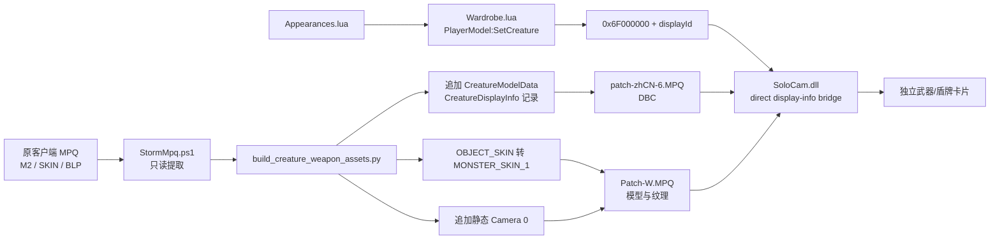

# SoloCollections 武器模型显示实现与 AI 接手说明

> 更新时间：2026-07-17  
> 项目根目录：`F:\1_projects\wow_projects`  
> 客户端目录：`D:\Games\wow335\World of Warcraft11`  
> 适用客户端：WoW 3.3.5a build 12340，当前锁定客户端  
> 约束：构建、临时文件和项目资源不得写入 C 盘。

> 迁移说明：本文保留当时的绝对路径作为 2026-07-17 验证记录。统一仓库建立
> 后，当前源码分别位于 `addon/SoloCollections` 和
> `client-extension/SoloCam`；执行命令请以组件 README 和
> `docs/DEVELOPMENT.md` 为准，不要直接复制本文旧路径。

## 1. 当前成果

SoloCollections 外观页的主手、副手卡片已经可以独立显示武器和盾牌模型，不需要显示角色身体。当前演示数据包括：

- 阿什坎迪，兄弟会之剑（物品 19364）
- 雷霆之怒，逐风者的祝福之剑（物品 19019）
- 埃辛诺斯战刃主手（物品 32837）
- 埃辛诺斯战刃副手（物品 32838）
- 埃辛诺斯壁垒（物品 32375）

当前显示方式参考正式服外观页：

- 卡片里只显示物品模型。
- 物品长轴以对角线方式占据卡片。
- 普通武器约占卡片长边的四分之三到五分之四。
- 模型居中并留有窄安全边距。
- 已收集和未收集通过边框与文字区分，不用大面积灰色遮罩覆盖模型。
- 武器模型使用单独灯光，避免只显示黑色剪影而附加发光特效仍然可见。

目前采用的是兼容 3.3.5 的近似实现，不是把正式服 `UIModelScene` API 直接移植到旧客户端。

## 2. 必须理解的 3.3.5 限制

3.3.5 的普通 `Model`/`PlayerModel` 控件不能像正式服外观系统那样直接根据 `ItemDisplayInfo.dbc` 完成以下工作：

1. 自动选择物品 M2。
2. 自动绑定 `OBJECT_SKIN` 替换纹理。
3. 自动选择针对物品外形优化过的展示摄像机。
4. 直接把 `CreatureDisplayInfo` ID 传给 Lua 的 `PlayerModel:SetCreature()`。

其中第 4 点尤其容易理解错：原生 `SetCreature(number)` 把数字当成 Creature entry，而不是 `CreatureDisplayInfo` ID。直接传 40000 一类 display ID 会加载错误 NPC、空模型或崩溃。

因此当前实现同时使用了：

- 收藏专用 M2/SKIN/BLP 副本。
- 给物品 M2 追加的静态摄像机 0。
- 自定义 `CreatureModelData.dbc` 和 `CreatureDisplayInfo.dbc` 记录。
- `SoloCam.dll` 提供的 direct display-info bridge。
- Lua 中的显式灯光、缩放和朝向。

## 3. 当前正确架构



### 3.1 MPQ 资源层

主构建脚本从客户端 MPQ 中提取原始 M2、对应的 `00.skin` 和 BLP。随后生成收藏专用路径：

```text
Item\ObjectComponents\SoloCollections\SC_*.m2
Item\ObjectComponents\SoloCollections\SC_*00.skin
Item\ObjectComponents\SoloCollections\SC_*.blp
```

模型与纹理统一打入：

```text
D:\Games\wow335\World of Warcraft11\Data\Patch-W.MPQ
```

DBC 统一打入本地化补丁：

```text
D:\Games\wow335\World of Warcraft11\Data\zhCN\patch-zhCN-6.MPQ
```

不需要每件武器创建一个 MPQ。所有武器可以进入同一个资源 MPQ，所有自定义 DBC 行可以进入同一个 locale MPQ。

### 3.2 M2 纹理转换

当前正式构建入口不是把 BLP 文件名直接硬编码到 M2，而是：

1. 将 M2 纹理描述符中的 `OBJECT_SKIN`（类型 2）改成 `MONSTER_SKIN_1`（类型 11）。
2. 清空该纹理描述符里的文件名。
3. 把 replaceable texture lookup 扩展为 13 项。
4. 让索引 11 指向原来的物品皮肤纹理描述符。
5. 在 `CreatureDisplayInfo.dbc` 的第一皮肤纹理字段中写入自定义 BLP 名称。

实现文件：

- `tools\SoloCollectionsClientCamera\scripts\build_creature_weapon_assets.py`
- `convert_object_skin()` 是当前主路线。

`patch_item_m2_textures.py` 里仍然有 `patch_object_skin_bytes()`，它属于早期“把 BLP 路径硬编码进 M2”的实验路线。主构建脚本目前只从该文件复用 M2 校验、常量和 `append_static_item_camera()`。不要在没有明确验证的情况下把主路线改回直接硬编码纹理。

### 3.3 M2 摄像机

原物品 M2 没有可供普通 UI 模型控件使用的展示摄像机。`append_static_item_camera()` 会向 M2 版本 264 追加 camera 0。

当前关键参数位于：

```text
tools\SoloCollectionsClientCamera\scripts\patch_item_m2_textures.py
```

当前参数：

```python
distance = max(radius * 2.65, 1.45)

position = (
    center_x - distance * 0.6666667,
    center_y - distance * 0.3333333,
    center_z + distance * 0.6666667,
)
target = (center_x, center_y, center_z)
```

摄像机记录参数：

```python
camera_id = 0
field_of_view = 0.7853982  # 约 45 度
far_clip = 100.0
near_clip = 0.05
```

调参原则：

- 模型太小：减小 `radius` 乘数，例如从 `2.65` 调到 `2.45`。
- 模型被裁切：增大乘数，例如从 `2.65` 调到 `2.80`。
- 所有模型整体偏向同一方向：调整 `position` 三个轴的权重。
- 当前相机方向测试：相机位于 `(-X, -Y, +Z)` 象限。它相对上一版在水平面
  绕模型旋转 180 度，用于保持左下到右上的斜率并交换刀柄、刀刃端点。
- 单件武器朝向不合适：优先修改 Lua 记录的 `m2Camera.yaw`，不要为单个物品改全局摄像机。
- 单件武器大小不合适：优先修改 Lua 记录的 `modelScale`。
- 单件武器位置不合适：增加 `modelPosition = { x, y, z }`。

摄像机修改后必须重新生成 M2 并重新打包，单纯 `/reload` 不会重新载入 MPQ。

### 3.4 DBC 记录

当前构建脚本以已有 DBC 记录为模板：

- `CreatureModelData` 模板 ID：1
- `CreatureDisplayInfo` 模板 ID：141

当前自定义 ID：

| 外观 | CreatureModelData ID | CreatureDisplayInfo ID |
|---|---:|---:|
| 阿什坎迪 | 4000 | 40000 |
| 雷霆之怒 | 4001 | 40001 |
| 战刃主手 | 4002 | 40002 |
| 战刃副手 | 4003 | 40003 |
| 埃辛诺斯壁垒 | 4004 | 40004 |

构建器会检查：

- ID 必须大于 0。
- ID 不能与基础 DBC 已有记录冲突。
- 同一批配置中不能重复使用 ID。
- `CreatureModelData` 支持当前客户端出现过的 26 字段/104 字节和 28 字段/112 字节布局。
- `CreatureDisplayInfo` 要求 16 字段/64 字节布局。

不要随意复用现有 display ID。ID 冲突曾导致卡片显示成 NPC 模型。

### 3.5 DLL 直连 display ID

Lua 不直接调用：

```lua
model:SetCreature(displayId)
```

当前调用方式是：

```lua
local DIRECT_DISPLAY_REQUEST_BASE = 0x6F000000
model:SetCreature(DIRECT_DISPLAY_REQUEST_BASE + record.creatureDisplayId)
```

`SoloCam.dll` hook `PlayerModel:SetCreature` 的 Lua binding，识别保留区间请求，减去 `0x6F000000` 得到真正 display ID，然后构造稳定存在的 `SyntheticCreatureRecord`。

旧客户端内部会从 creature-cache record 的 `+0x24` 偏移读取 display ID。这个记录不能放在临时栈变量里；当前代码在固定数组 `g_directDisplayModels` 中为每个 PlayerModel 保存稳定记录。此前直接使用错误指针或短生命周期对象会造成 `ACCESS_VIOLATION`。

相关文件：

- `src\DisplayInfoBridge.hpp`
- `src\DisplayInfoBridge.cpp`
- `src\SoloCam.cpp`
- `src\ClientAddresses.hpp`

DLL 地址只适用于当前锁定客户端。客户端 SHA256：

```text
AA63A5750D60EF16746C686B3D5E26876D98953EAB08B1C026CD0FAF78E88CB8
```

换客户端前必须重新定位地址和原始机器码，不能直接复用。

### 3.6 Lua 展示层

数据定义：

```text
插件\SoloCollections\Data\Appearances.lua
```

每个独立物品至少需要：

```lua
{
    id = 50,
    itemId = 19364,
    slot = "MAINHAND",
    modelPath = "Item\\ObjectComponents\\SoloCollections\\SC_*.m2",
    modelScale = 0.82,
    m2Camera = {
        yaw = 0,             -- 相对 M2 camera 0，弧度
        pitch = 0,           -- 相对俯仰，弧度
        distanceScale = 1.0, -- 相对原始 M2 camera 0 的距离
        target = { 0, 0, 0 },
    },
    modelPosition = { 0, 0, 0 }, -- 可选
}
```

`m2Camera` 是 camera 0 的相对姿态，而不是模型网格旋转。它可由 Lua 逐项控制
`yaw`、`pitch`、`distanceScale` 和 target 的 XYZ 偏移；初始全零 pose 保持已验证的
M2 静态构图。单件微调应从 `m2Camera.yaw` 开始。

并在 `standaloneDisplayIds` 中把外观 ID 映射到自定义 `CreatureDisplayInfo` ID。

UI 实现：

```text
插件\SoloCollections\UI\Wardrobe.lua
```

关键行为：

- 使用 `CreateFrame("PlayerModel", ...)` 创建独立模型帧。
- 有 `creatureDisplayId` 时走 DLL bridge。
- `modelPath` 只作为没有 bridge 数据时的回退路径。
- `SC.M2Camera.Apply(model, record.m2Camera)` 通过 SoloCam v5 将 Lua pose 传给
  M2 camera 0；DLL 只在渲染期间覆盖 camera 的 position/target，随后立即恢复。
- `SetModelScale()`、`SetPosition()` 仍用于网格占比和偏移；有 `m2Camera` 的记录不再
  用 `SetRotation()` 旋转网格，避免与相机 pose 叠加。无该记录的旧数据仍保留
  `SetRotation()` / `SetFacing()` 回退。
- 每次显示模型都显式调用 `SetLight()`。

当前灯光参数：

```lua
model:SetLight(
    true, false,
    -1.0, -0.7, -0.5,
    0.82, 1.0, 1.0, 1.0,
    0.72, 1.0, 0.95, 0.88
)
```

如果模型主体全黑但发光特效可见，先检查 BLP/replaceable texture 绑定，再检查 `SetLight()` 是否执行。

## 4. 使用的工具

| 工具 | 路径或版本 | 用途 |
|---|---|---|
| PowerShell | Windows 本机 | 编排提取、构建、部署、备份和校验 |
| Python | 3.10.6 | 解析和修改 M2、DBC，生成构建配置 |
| `struct` | Python 标准库 | 二进制读写 M2/DBC，不依赖图形编辑器 |
| StormLib | `tools\StormLib\storm_dll\x64\StormLib.dll` | 读取、创建和写入 MPQ |
| StormLib PowerShell 包装 | `tools\StormMpq.ps1` | `create/add/extract/compact` 操作 |
| MSVC Build Tools | `D:\vs\buildtools`，编译器 19.44 | 编译 x86 `SoloCam.dll` 和测试程序 |
| `build-weapon-models.ps1` | `tools\SoloCollectionsClientCamera\scripts` | 武器资源完整构建与部署入口 |
| `build_creature_weapon_assets.py` | 同上 | 转换 M2 纹理类型、追加 DBC 行、复制资源 |
| `patch_item_m2_textures.py` | 同上 | M2 校验、旧实验纹理补丁、当前静态摄像机实现 |
| `deploy-poc.ps1` | 同上 | 编译并部署 `SoloCam.dll` 和自定义启动程序 |
| 游戏截图 | ShareX 等 | 与正式服逐卡片对比模型占比、角度和留白 |

没有使用 Blender、3ds Max 或 M2Mod 修改网格。当前调整只涉及既有 M2 的纹理描述、摄像机记录和客户端展示桥接。

## 5. 构建与部署

### 5.1 修改 DLL 后

先关闭客户端，然后执行：

```powershell
& 'F:\1_projects\wow_projects\tools\SoloCollectionsClientCamera\scripts\deploy-poc.ps1'
```

该脚本会：

1. 使用 `D:\vs\buildtools\VC\Auxiliary\Build\vcvarsall.bat x86`。
2. 编译测试程序。
3. 编译 32 位 `SoloCam.dll`。
4. 从原 `Wow.exe` 生成 `Wow-SoloCam-PoC.exe`。
5. 复制 DLL 到客户端目录。

原 `Wow.exe` 不会被覆盖。

### 5.2 修改武器列表、纹理或 M2 摄像机后

先关闭客户端，然后执行：

```powershell
& 'F:\1_projects\wow_projects\tools\SoloCollectionsClientCamera\scripts\build-weapon-models.ps1' -Deploy
```

该脚本会：

1. 从客户端 MPQ 提取源 M2/SKIN/BLP。
2. 从 `Data\zhCN\patch-zhCN-5.MPQ` 提取基础 DBC。
3. 在 F 盘创建时间戳构建目录。
4. 生成收藏专用资源和新 DBC。
5. 生成 `Patch-W.MPQ` 与 `patch-zhCN-6.MPQ`。
6. 部署前备份客户端已有同名补丁。
7. 从最终 MPQ 回读所有文件并比较 SHA256。
8. 输出 `weapon-model-verification.csv`。

构建目录：

```text
F:\1_projects\wow_projects\_work\solo_collections_weapon_models\build_时间戳
```

备份目录：

```text
F:\1_projects\wow_projects\_work\solo_collections_weapon_models\backups\时间戳
```

### 5.3 修改插件 Lua 后

同步插件源码：

```powershell
Copy-Item -LiteralPath `
  'F:\1_projects\wow_projects\插件\SoloCollections\Data\Appearances.lua' `
  -Destination 'D:\Games\wow335\World of Warcraft11\Interface\AddOns\SoloCollections\Data\Appearances.lua' `
  -Force

Copy-Item -LiteralPath `
  'F:\1_projects\wow_projects\插件\SoloCollections\UI\Wardrobe.lua' `
  -Destination 'D:\Games\wow335\World of Warcraft11\Interface\AddOns\SoloCollections\UI\Wardrobe.lua' `
  -Force
```

只改 Lua 时通常可以重载界面，但改过 MPQ、DBC、M2 或 DLL 后必须完全退出并重新启动：

```text
D:\Games\wow335\World of Warcraft11\Wow-SoloCam-PoC.exe
```

## 6. 添加一件新武器的步骤

### 第一步：确定数据

需要确定：

- 物品 ID。
- 主手或副手分类。
- 源 M2 的 MPQ 内路径。
- 对应 `00.skin`。
- 实际使用的 BLP 路径。
- 新且不冲突的 `CreatureModelData` ID。
- 新且不冲突的 `CreatureDisplayInfo` ID。

不要只根据图标或物品名猜 M2/BLP。应从本地 `ItemDisplayInfo.dbc`、物品数据或已验证 MPQ 文件反查。

### 第二步：扩展 PowerShell 模型配置

在 `build-weapon-models.ps1` 的 `$Models` 数组增加记录：

```powershell
[pscustomobject]@{
    Source = 'Item\ObjectComponents\Weapon\源模型名'
    Target = 'Item\ObjectComponents\SoloCollections\SC_唯一名称_物品ID'
    Texture = 'ITEM\OBJECTCOMPONENTS\WEAPON\实际纹理.BLP'
    TextureName = 'SC_唯一纹理名_物品ID'
    ModelId = 4005
    DisplayId = 40005
}
```

盾牌的源目录通常是 `Item\ObjectComponents\Shield`，不能强行按 Weapon 目录处理。

### 第三步：扩展插件数据

在 `Appearances.lua` 增加外观记录，并在 `standaloneDisplayIds` 增加映射：

```lua
{ id = 55, itemId = 12345, slot = "MAINHAND", ..., modelScale = 0.86, m2Camera = { yaw = 0, pitch = 0, distanceScale = 1.0, target = { 0, 0, 0 } } },

local standaloneDisplayIds = {
    -- 旧记录
    [55] = 40005,
}
```

### 第四步：构建并启动

```powershell
& 'F:\1_projects\wow_projects\tools\SoloCollectionsClientCamera\scripts\build-weapon-models.ps1' -Deploy
```

同步 Lua，完全退出客户端，再使用 `Wow-SoloCam-PoC.exe` 启动。

### 第五步：按正式服截图微调

推荐顺序：

1. 先确认纹理正确，不是 NPC、盒子或黑模。
2. 调 `m2Camera.yaw` 确定物品正反面和对角方向。
3. 调 `modelScale` 控制卡片占比。
4. 最后才用 `modelPosition` 修正偏移。
5. 只有一整类武器都偏小时才修改 M2 全局 camera distance。

## 7. 已知失败现象与原因

| 现象 | 常见原因 | 正确处理 |
|---|---|---|
| 武器卡片出现 NPC | 把 display ID 当 Creature entry 传给 `SetCreature`；或自定义 DBC ID 冲突 | 使用 `0x6F000000 + displayId` bridge；检查 ID 冲突 |
| 武器是黑色剪影，发光特效可见 | `OBJECT_SKIN` 没有绑定；replaceable lookup 仍指向空纹理；或没有显式灯光 | 使用当前 `MONSTER_SKIN_1 + CreatureDisplayInfo` 路线；确认 `SetLight()` |
| 蓝白格子/盒子 | BLP 路径错误、纹理没打进 MPQ、纹理名与 DBC 不一致 | 从正确 MPQ 重新提取 BLP；核对内部路径和哈希 |
| 什么都不显示 | M2/SKIN 路径不匹配、没有 camera 0、display ID 未加载、DLL bridge 未安装 | 逐层检查 MPQ、DBC、Lua 映射、DLL 日志 |
| 点击收藏时 ACCESS_VIOLATION | hook 地址错误；给原生函数传了错误结构；临时 synthetic record 生命周期不足 | 锁定客户端 SHA256；使用稳定 `g_directDisplayModels` 存储 |
| 模型会随窗口位置缩放或跑到界面外 | 3.3.5 模型 viewport/摄像机处理错误，或用角色模型的旧绝对坐标方案 | 独立物品使用 M2 camera 0；不要用窗口屏幕坐标推导摄像机 |
| 模型太小 | camera distance 太大或单件 `modelScale` 太小 | 先调单件 `modelScale`；全体都小再改 `2.65` |
| 模型被裁切 | camera distance 太近、scale 太大或位置偏移 | 降低单件 scale，清零 position，必要时增大 camera distance |

## 8. 资源重复与后续批量化

当前 PoC 为每个配置项复制一套 M2、SKIN、BLP。少量演示物品可以接受，但把全部武器按这个方式简单循环会产生重复资源。

正确的批量化去重层级：

1. **几何去重**：相同源 M2 路径只生成一份收藏专用 M2/SKIN。
2. **纹理去重**：相同源 BLP 路径或相同 SHA256 只写入一份 BLP。
3. **显示记录复用**：相同模型和纹理组合可以复用同一个 `CreatureDisplayInfo`。
4. **模型记录复用**：多个不同纹理外观可以共享同一个 `CreatureModelData`，分别使用不同 `CreatureDisplayInfo`。
5. **统一归档**：全部资源仍然只使用一个 `Patch-W.MPQ` 和一个 locale DBC MPQ。

推荐先把 `$Models` 从手写数组改成 JSON/CSV 清单，再让构建器按以下键建立缓存：

```text
geometry_key = 规范化源 M2 路径
texture_key  = 源 BLP SHA256
display_key  = geometry_key + texture_key
```

完全不复制 M2/BLP 的方案需要进一步修改客户端渲染器：直接加载原 Item M2，并在运行时模拟装备渲染器从 `ItemDisplayInfo` 绑定替换纹理和专用摄像机。这更接近正式服，但改动面和崩溃风险明显高于当前兼容路线。

## 9. 校验命令

M2 纹理补丁单元测试当前通过：

```powershell
python -m unittest discover `
  -s 'F:\1_projects\wow_projects\tools\SoloCollectionsClientCamera\tests' `
  -p 'test_item_m2_texture_patch.py'
```

MPQ 构建脚本会自动回读并验证 SHA256。应检查最新构建目录中的：

```text
weapon-model-verification.csv
```

其中 `Match` 必须全部为 `True`。

注意：`test_wardrobe_integration.py` 当前有一条过时断言仍在查找旧符号 `PlayerModelSetDisplayInfo`，而现实现使用 `PlayerModelSetCreatureRecord`。在更新该测试前，不要把这一条失败误判成当前武器显示功能失败。

## 10. 给其他 AI 的操作规则

把本文件交给其他 AI 时，应同时明确以下要求：

1. 先阅读本文件和所有被引用的源码，再修改。
2. 不向 C 盘写入构建产物、缓存或临时文件。
3. 不覆盖原始 `Wow.exe`。
4. 不把 `CreatureDisplayInfo` ID 直接传给原生 `SetCreature()`。
5. 不混用“硬编码 BLP 的旧实验路线”和当前 `MONSTER_SKIN_1 + DBC + bridge` 路线。
6. 修改 DLL 前先确认客户端 SHA256 和 hook 原始字节。
7. 修改资源前关闭客户端；MPQ/DBC/M2 变更后完整重启。
8. 每次部署必须保留旧 MPQ/DLL/Lua 备份。
9. 用本地 DBC 和 MPQ 反查模型与纹理，不硬编码未经验证的路径。
10. 先完成一件武器的端到端验证，再批量生成全部武器。

可直接给其他 AI 的任务提示：

```text
请先完整阅读：
F:\1_projects\wow_projects\tools\SoloCollectionsClientCamera\WEAPON_MODEL_DISPLAY_HANDOFF.md

目标：在现有 SoloCollections 武器展示链路上继续开发，不重新设计路线。
当前正确路线是：MONSTER_SKIN_1 + CreatureDisplayInfo/CreatureModelData +
SoloCam.dll direct display-info bridge + M2 camera 0。

不要把 display ID 直接传给原生 SetCreature；不要使用旧的硬编码 BLP 路线替换主构建；
不要向 C 盘写文件；构建工具固定使用 D:\vs\buildtools；所有临时文件放到
F:\1_projects\wow_projects\_work。

修改前先检查当前源码、客户端是否关闭、目标 ID 是否与 DBC 冲突；修改后构建、
部署、回读 MPQ 并校验 SHA256。请先报告你准备改动的文件和原因，再执行。
```
