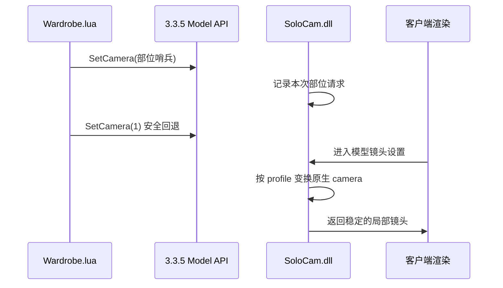

# 08 客户端 SoloCam 扩展

## 1. 为什么需要客户端扩展

WoW 3.3.5a 的插件 Lua 能创建 `PlayerModel`、`DressUpModel`，也能换装，但原生接口不能像正式服那样为同一角色模型稳定设置头、肩、手腕、腰、腿等独立局部镜头。

早期只在 Lua 中尝试移动模型或使用原生 camera，出现过以下问题：

- 所有部位都停留在头部镜头；
- 窗口左右移动后模型大小和宽度发生变化；
- 多个模型跑到卡片外或世界画面中；
- 给角色 M2 强行增加第三个 camera 后，获取角色时触发 `ERROR #132`；
- 模型重复初始化、闪烁或黑屏。

最终保留方案是：Lua 负责声明“想看哪个部位”，`SoloCam.dll` 在客户端渲染路径中把原生 dressing-room camera 临时变换成对应部位的镜头。

## 2. 代码位置

```text
tools/SoloCollectionsClientCamera/
├─ src/
│  ├─ SoloCam.cpp
│  ├─ CameraProfile.cpp
│  ├─ CameraProfile.hpp
│  └─ DisplayInfoBridge.*
├─ tests/
├─ scripts/
│  ├─ build.ps1
│  └─ deploy-poc.ps1
└─ README.md
```

Lua 接入点：

```text
插件/SoloCollections/UI/Wardrobe.lua
```

## 3. 镜头握手流程



哨兵和参数见 [07-外观各部位镜头参数.md](07-外观各部位镜头参数.md)。

关键原则：

1. 哨兵只传递意图，不是实际 camera 索引。
2. DLL 不存在时，紧随其后的 `SetCamera(1)` 必须仍能显示安全的原生模型。
3. 变换依据模型 camera 数据，不依据收藏窗口的屏幕位置。
4. 每张卡片只能操作自己的 model frame，不能把全局渲染状态长期留在修改状态。

## 4. 稳定性设计

### 4.1 不修改玩家 M2 camera 数量

不要再向角色 M2 追加第三个 camera。该路线已经实际触发过客户端崩溃。角色局部镜头由运行时变换完成。

### 4.2 保存与恢复渲染状态

Hook 只在目标模型的镜头设置阶段生效。修改 camera/viewport/transform 后必须恢复原状态，否则会出现：

- 窗口移动导致缩放改变；
- 模型泄漏到世界画面；
- 后续卡片继承上一张卡片的镜头；
- 关闭收藏后其他 `PlayerModel` 异常。

### 4.3 稳定记录生命周期

武器 direct-display bridge 使用的 synthetic record 必须有稳定生命周期，不能把栈内临时对象地址交给客户端。详见第 09 篇。

### 4.4 保护性回退

所有版本相关的客户端地址都应满足：

- 只针对已验证的 3.3.5a 客户端构建；
- Hook 安装失败时禁用扩展，不应继续写入未知地址；
- 未识别哨兵时执行原逻辑；
- 输入 display ID、模型指针为空时直接回退。

## 5. 编译

本项目固定使用 D 盘的 Visual Studio Build Tools：

```powershell
Set-Location '.\client-extension\SoloCam'
powershell -ExecutionPolicy Bypass -File .\scripts\build.ps1
```

脚本使用：

```text
$env:SOLOCOLLECTIONS_VCVARS = 'D:\path\to\vcvarsall.bat'
```

并以 `x86` 构建，因为 WoW 3.3.5a 客户端是 32 位进程。临时文件和产物保留在项目自己的 `build` 目录，不要写入 C 盘。

`build.ps1` 会编译下列目标，其中只自动运行两个单元测试：

- 自动运行：`CameraProfileTests`、`DisplayInfoBridgeTests`；
- 只编译：`LoadLibraryProbe`、`ProcessProbe`；
- 生成：`SoloCam.dll`。

如需使用两个 Probe，必须按其参数约定单独执行，不能把“成功编译”写成“已经运行验证”。

## 6. 部署 PoC

默认测试客户端：

```text
D:\path\to\WoW-3.3.5a
```

执行：

```powershell
Set-Location '.\client-extension\SoloCam'
powershell -ExecutionPolicy Bypass -File .\scripts\deploy-poc.ps1
```

部署脚本应生成或更新：

- `Wow-SoloCam-PoC.exe`；
- `SoloCam.dll`。

不要覆盖原始 `Wow.exe`。测试失败时退出 PoC 客户端，删除 PoC EXE 和 DLL 即可回退。

## 7. 改动后的最小验证

1. 运行单元测试。
2. 用 PoC EXE 登录。
3. 打开收藏外观页，分别查看头、肩、胸、背、手腕、手、腰、腿、脚。
4. 拖动整个收藏窗口到屏幕左右两侧，模型大小不能变化。
5. 连续切换物品、翻页、切换套装和物品页，模型不能放大、闪烁或泄漏。
6. 关闭收藏后检查角色选择、试衣间及世界 UI 是否正常。

## 8. 交给其他模型时的任务模板

```text
只修改 tools/SoloCollectionsClientCamera 与 Wardrobe.lua 的镜头握手。
目标客户端是 32 位 WoW 3.3.5a。
不要修改原始 Wow.exe，不要给角色 M2 增加 camera，不要使用屏幕坐标计算镜头。
通过环境变量或 `vswhere` 查找构建工具，所有中间产物放在组件的 `build` 目录。
改动后运行 CameraProfileTests 和 DisplayInfoBridgeTests，并给出 PoC 部署命令。
```
