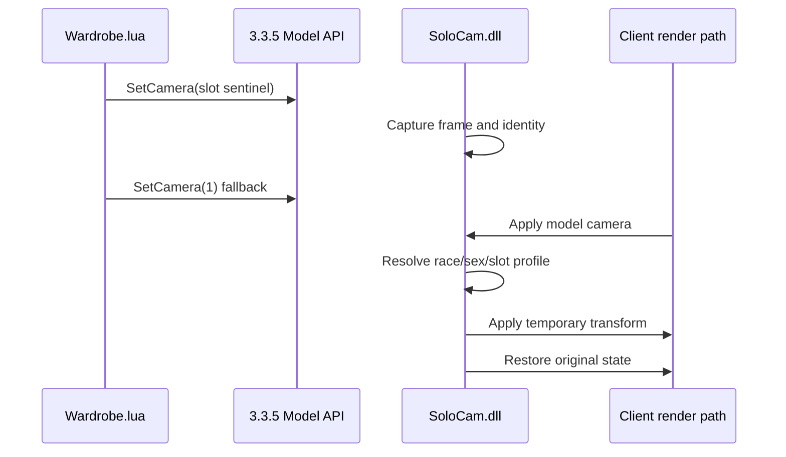

# 08 客户端 SoloCam 扩展

## 1. 作用与边界

WoW 3.3.5a 的 AddOn API 可以创建 `PlayerModel`/`DressUpModel`，但不能稳定地
为九个装备部位和各种独立武器提供正式服风格构图。SoloCam 因此在已验证的
客户端渲染路径上增加两个受限 bridge：

- **BodyCameraBridge**：按 race、sex、slot 应用身体部位镜头；
- **ItemCameraBridge**：为独立武器/副手模型绑定 display 和镜头参数。

SoloCam 只负责显示。收藏状态、账号授权、数据库和服务端动作均由
`mod-solo-collections` 负责。

## 2. 严格客户端边界

当前源码只支持：

```text
World of Warcraft 3.3.5a build 12340
x86 process
Original Wow.exe SHA-256:
AA63A5750D60EF16746C686B3D5E26876D98953EAB08B1C026CD0FAF78E88CB8
```

任何 hash、PE 架构或补丁点原字节不匹配都必须停止。禁止把地址“试着套用”
到其他客户端，不给角色 M2 增加 camera，也不覆盖原始 `Wow.exe`。

源码位置：

```text
client-extension/SoloCam/
├─ src/
│  ├─ SoloCam.cpp
│  ├─ BodyCameraBridge.*
│  ├─ CameraProfile.*
│  ├─ DisplayInfoBridge.*
│  ├─ ItemCameraBridge.*
│  └─ ClientAddresses.hpp
├─ tests/
├─ scripts/
└─ README.md
```

仓库不包含构建后的 DLL、补丁 EXE、MPQ、DBC、M2、SKIN 或 BLP。

## 3. 身体部位镜头

AddOn 用受控 sentinel 表达“当前卡片要查看哪个部位”，SoloCam 在目标模型的
镜头设置阶段解析当前 race、sex、slot，然后对原生 dressing-room camera 做
临时变换：



哨兵只传递意图，不是 M2 camera 索引。DLL 缺失、profile 未知或 hook 未安装时，
紧随其后的原生 `SetCamera(1)` 仍应提供安全回退。

当前生成数据覆盖 20 个基础 race/sex 页面、每页九个装备部位，共 180 个基础
profile。HD/自定义模型、不同体型和少数部位仍需要社区实机校准。

## 4. 独立武器与副手

普通 3.3.5 `Model:SetModel` 不能自动完成所有物品 display 的贴图绑定。
ItemCameraBridge 使用稳定生命周期的 synthetic record，把已经由资源流水线
准备好的 display/model/texture 组合交给客户端，并在模型绘制时应用：

```text
yaw / pitch / roll
distanceScale
targetOffsetX / targetOffsetY / targetOffsetZ
```

参数优先级为：

```text
appearance override > model override > weapon-family default > auto camera
```

不要把栈内临时对象地址交给客户端，不要用 NPC entry 充当武器容器，也不要把
贴图错误形成的黑模误判成镜头问题。资源链路详见
[09-武器与副手独立模型.md](09-武器与副手独立模型.md)。

## 5. 构建

需要 Windows 10/11、Visual Studio 2022 Desktop development with C++、
MSVC v143 x86 工具链和 Windows SDK。

```powershell
$env:SOLOCOLLECTIONS_VCVARS = '<Visual Studio>\VC\Auxiliary\Build\vcvarsall.bat'
& .\client-extension\SoloCam\scripts\build.ps1
```

脚本以 x86 构建，并把中间文件、检查程序和 `SoloCam.dll` 放在被 Git 忽略的
`client-extension/SoloCam/build/`。环境变量未设置时可通过 `vswhere` 查找
Visual Studio。

## 6. 本地部署与回退

先关闭客户端并保留完整客户端备份，再显式指定目标目录：

```powershell
& .\client-extension\SoloCam\scripts\deploy-poc.ps1 `
  -ClientDirectory '<WoW-3.3.5a directory>'
```

部署路径只创建或更新：

```text
Wow-SoloCam-PoC.exe
SoloCam.dll
```

原始 `Wow.exe` 必须保持不变，作为回退入口。若部署脚本拒绝 hash/字节检查，
不要手工绕过。回退时关闭客户端，恢复部署前备份或删除本 PoC 创建且 hash
已确认的文件。

武器资源脚本默认先构建、回读并报告 hash；不要在首次执行时使用 `-Deploy`。
具体命令见 [`client-extension/SoloCam/README.md`](../../client-extension/SoloCam/README.md)。

## 7. 镜头参数贡献

身体镜头 identity 是 `(raceId, sex, slot)`；武器参数可按 weapon family、
model 或 appearance 覆盖。先用 AddOn 内镜头工作台调整并导出 JSONL，不要直接
在 C++ 中堆叠个人特例。

每份镜头贡献至少应包含：

- WoW build、locale、原始/HD/自定义模型说明；
- race、sex、slot 或武器 appearance/model/family identity；
- 修改前后参数；
- 固定窗口尺寸下的修改前/后截图；
- 翻页、切页、移动窗口和关闭重开的结果；
- 长武器、盾牌或极端模型的完整边界截图。

完整字段、导入工具和 PR 格式见
[`docs/CAMERA_CONTRIBUTIONS.md`](../CAMERA_CONTRIBUTIONS.md)。

## 8. 不变量和验收

- Hook 只在目标模型绘制期间生效，结束后恢复 camera/render 状态；
- 窗口位置不能参与镜头计算；
- generation 变化后旧异步回调不能覆盖新卡片；
- 未识别 sentinel/profile/display 必须安全回退；
- 同一模型连续翻页不能闪烁、放大或泄漏到世界画面；
- 构建/加载成功只证明技术链路，镜头是否正常必须由真实客户端截图确认。

Agent 继续开发前应同时阅读
[`docs/AGENT_DEVELOPMENT.md`](../AGENT_DEVELOPMENT.md) 和仓库根目录
[`AGENTS.md`](../../AGENTS.md)，并把客户端部署、数据库写入和 GitHub 发布留给
明确授权的人工步骤。
