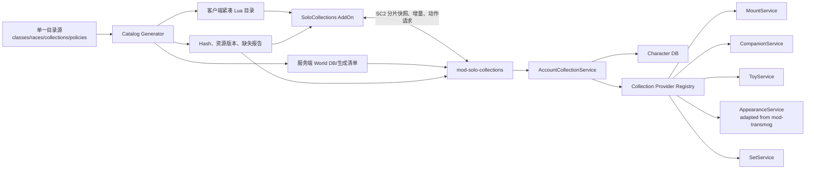

# SoloCollections 统一收藏后端设计

日期：2026-07-19
状态：已确认方向，待实施计划
适用项目：SoloCollections、未来的 `mod-solo-collections`、AzerothCore 3.3.5a

## 1. 已确认的架构决定

SoloCollections 采用“客户端 Lua AddOn + 单一 C++ 服务端模块”的长期架构。

服务端模块以本地 `mod-transmog` 为代码和 Git 历史起点，fork 后重构为 `mod-solo-collections`。运行时不再同时安装一个独立的 `mod-transmog` 后端和另一个收藏后端；原模块中可复用的幻化代码成为统一模块内部的 `AppearanceService`。

这项决定包含以下约束：

- 客户端 UI 继续使用 Lua，不尝试用服务端 C++ 替代 AddOn。
- ALE Lua 后端只用于迁移期和协议原型；C++ 接管后必须停用对应写入和动作入口。
- 账号收藏、权限判断、数据库状态、同步 revision 和动作执行只有一个服务端权威来源。
- 坐骑、小宠物、玩具、外观和套装是同一收藏平台中的不同 provider，不是五套互不相干的系统。
- 新种族、新职业和新收藏类别必须通过注册表、能力标签和策略扩展，不能把 3.3.5 的固定枚举和位掩码散落到业务代码中。
- `mod-transmog` 上游以后作为选择性吸收修复的代码来源，不再要求无冲突整体升级。

## 2. 目标

### 2.1 功能目标

- 展示当前服务端和客户端资源包中可用的全部收藏目录。
- 保存账号级坐骑、小宠物、玩具和外观解锁。
- 同账号不同角色共享收藏，并向同账号所有在线会话发送增量。
- 复用并加固 `mod-transmog` 的外观兼容、应用、持久化和显示能力。
- 套装进度由外观成员推导，支持预览和原子应用。
- 目录、协议和数据库允许后续加入高版本内容。
- 为新种族、新职业以及新的收藏类别保留明确扩展点。

### 2.2 工程目标

- 单一后端权威、单一账号缓存、单一 revision、单一协议入口。
- 客户端不参与授权，只发送稳定收藏 ID 和受限动作参数。
- 数据库是权威，缓存始终可从数据库重建。
- 目录由单一源数据生成，客户端、服务端和资源清单共享同一映射版本。
- 类别代码相互隔离；禁用外观模块不能影响坐骑、宠物和玩具。
- SQL migration 可重复执行、可审计、可恢复。
- 所有高版本条目在构建期或启动期校验，缺项时禁用条目而不是崩溃。

## 3. 非目标和边界

- 第一轮 C++ 实现不同时完成所有收藏类别；按坐骑、小宠物、玩具、外观、套装的顺序交付纵切。
- 收藏系统不自动完成新种族、新职业的 Core、DBC、角色创建 UI、模型和动画移植；它只保证这些内容完成底层移植后，不需要重写收藏后端。
- 小宠物仍指 3.3.5 vanity companion，不把模型召唤包装成完整战斗宠物系统。
- “装备账号共享”指外观解锁共享，不复制实际物品实例、附魔、随机属性或耐久。
- 成就、声望、配方等已有权威系统默认只提供只读/派生视图，不复制第二份状态。
- 客户端 SavedVariables 只保存 UI 偏好和缓存，不能授予收藏权限。

## 4. 源码和发布边界

推荐保留两个源码交付物，但运行时只有一个后端：

1. `SoloCollections`
   - AddOn、目录生成器、客户端扩展、文档、打包和端到端测试。
2. `mod-solo-collections`
   - 从 `mod-transmog` fork 的统一 AzerothCore C++ 模块。

这样可以保留 `mod-transmog` 的 Git 历史和 AGPLv3 归属，同时不把 AzerothCore module 的构建结构强行塞进 AddOn 仓库。SoloCollections 的发布清单必须固定配套后端 commit、协议版本、目录 Hash 和资源包版本。

推荐的上游管理方式：

- `origin` 指向项目自己的 `mod-solo-collections`。
- `upstream` 指向原始 `mod-transmog`。
- 安全修复、Core 兼容修复按提交选择性移植。
- 不对已经大幅分叉的分支执行未经审计的整体 merge。
- 每次吸收上游变化都运行权限、事务、缓存和真实客户端回归测试。

## 5. 总体架构



## 6. C++ 组件边界

### 6.1 `AccountCollectionService`

统一收藏业务入口，负责：

- 取得当前 `WorldSession` 的账号 ID，绝不接受客户端传入账号 ID。
- 管理账号 `Loading / Ready / Failed` 状态。
- 执行幂等 `TryUnlock`、GM grant/revoke 和历史导入。
- 分配账号 revision，并向同账号在线会话广播增量。
- 调用 provider 判断当前角色能否使用收藏。
- 将数据库错误、目录错误和动作错误转换为稳定 reason code。

所有 hook、命令和 AddOn 请求都必须进入这个服务，不能绕过它直接修改缓存或调用幻化入口。

### 6.2 `AccountCollectionCache`

- 只懒加载在线账号，不在世界启动时加载所有离线账号。
- 每个账号保存状态、owned 集合、pending 写入、revision、登录 generation 和在线会话引用计数。
- 缓存是数据库派生状态；进程重启后可以完整重建。
- 异步回调只捕获账号 ID、角色 GUID 和 generation，不捕获可能已经失效的裸 `Player*`。
- 多地图线程下由明确的 world-thread 串行队列或锁保护，不能依赖“单人服通常没有并发”。
- 最后一个会话登出后延迟淘汰，避免快速换角色重复加载。

### 6.3 `CollectionCatalogMgr`

- 加载不可变目录、类别描述、身份注册表、动作映射和限制策略。
- 为每个类别维护独立 `mappingHash`、`metadataVersion` 和 `assetPackVersion`。
- 校验重复 ID、非法引用、依赖环、缺失模板和不支持的动作。
- reload 时先构建完整新快照，校验成功后原子替换；失败保留旧快照。

### 6.4 `CollectionProtocol`

- 独占新协议前缀 `SC2`。
- 负责握手、功能位、目录版本、分片、校验、限流、请求去重和超时。
- 只传稳定 `typeId + collectionId`；spellId、itemId、displayId 和脚本名由服务端目录解析。
- 每个类别可以独立 ready/disabled/mismatch，外观失败不能使坐骑页不可用。

### 6.5 `CollectionProviderRegistry`

收藏核心不通过巨大 `switch` 硬编码所有类别。每个类别注册一个 provider，概念接口包含：

```text
GetDescriptor()
ValidateCatalogEntry(entry, report)
LoadOwned(accountId)
TryUnlock(context, collectionId)
EvaluateUsability(context, collectionId)
ExecuteAction(context, collectionId, action, parameters)
BuildSnapshot(accountState)
OnCatalogReload(oldCatalog, newCatalog)
```

provider 只能通过 `AccountCollectionService` 获得账号状态和提交写入，不能维护第二个账号级真相。

## 7. 可扩展收藏类别模型

### 7.1 类别描述

每种收藏类别都有稳定描述，而不是依赖标签页顺序：

```text
typeId              永不复用的协议/数据库 ID
typeKey             稳定字符串，如 MOUNT、TOY、APPEARANCE
schemaVersion       类别数据版本
ownershipScope      ACCOUNT、CHARACTER、DERIVED、EXTERNAL
storageMode         PERSISTED、DERIVED、EXTERNAL
catalogMode         STATIC、GENERATED、DATABASE、EXTERNAL
uiTemplate          LIST_DETAIL、ICON_GRID、MODEL_GRID、WARDROBE、CUSTOM
supportedActions    PREVIEW、SUMMON、USE、APPLY、CLAIM 等
dependencies        例如 SET 依赖 APPEARANCE
featureFlag         服务端功能开关
```

`typeId`、`typeKey` 和 `collectionId` 一旦发布不得重新用于其他内容。删除条目必须留下 tombstone 或 alias。

### 7.2 AddOn 页面注册

客户端增加 `PageRegistry`，将类别与页面模板解耦：

- 通用列表＋详情模板；
- 通用图标网格模板；
- 通用模型网格模板；
- 衣柜模板；
- 套装详情模板；
- 必要时注册完全自定义页面。

简单类别应做到“增加源目录、生成数据、注册描述”即可出现；只有特殊交互才新增 C++ provider 或自定义 Lua 页面。服务端握手返回支持的类别和功能位，客户端不应假定五个标签永远全部存在。

### 7.3 当前类别

| 类别 | 状态来源 | 持久化 | 主要动作 |
|---|---|---|---|
| 坐骑 | 有效坐骑法术、显式目录、GM/导入 | 账号 | 预览、召唤 |
| 小宠物 | vanity companion 法术/物品、显式目录 | 账号 | 预览、召唤、解散 |
| 玩具 | 人工审核的显式目录 | 账号 | 使用、拖动、查看冷却 |
| 外观 | 物品获得路径和历史导入 | 账号 | 预览、应用、移除 |
| 套装 | 外观成员和替代成员 | 派生 | 预览、原子应用 |

### 7.4 适合后续增加的类别

以下内容只预留接口，不要求第一轮同时实现：

| 候选类别 | 推荐状态模型 | 关键边界 |
|---|---|---|
| 武器附魔幻象 | 账号持久化 | 与普通物品附魔数值分离，只改变视觉 |
| 战袍/衬衣外观 | 账号持久化或外观子类 | 当前 WotLK 衣柜导航不显示这些槽位，未来应独立启用 |
| 传家宝 | 账号持久化 | 解锁与“生成实际物品”分离；领取必须单独验证和审计 |
| 头衔 | EXTERNAL 或账号策略层 | Core 已有角色 title 状态；若改账号共享需定义授予规则，不能复制两份真相 |
| 成就收藏视图 | EXTERNAL/DERIVED | 默认读取现有成就系统，只做聚合展示 |
| 配方/专业图鉴 | EXTERNAL/DERIVED | 当前角色可学习与账号曾解锁必须分开显示 |
| 角色自定义外观 | 账号持久化 | 发型、肤色、纹身、面部等依赖客户端资源和定制入口 |
| 职业形态/召唤物皮肤 | 账号或职业范围 | 必须经过职业能力和当前形态验证 |
| 猎人宠物外观图鉴 | DERIVED 或独立 provider | 不能与 vanity companion 或真实宠物实例混用 |
| 坐骑装备/坐骑外观变体 | 账号持久化 | 3.3.5 无原生系统，需要自定义行为规则 |
| 法术视觉、光环、足迹 | 账号持久化 | 只允许白名单效果，避免战斗数值和永久 aura 泄漏 |
| 表情、动作、姿态 | 账号持久化 | 依赖客户端动画和种族骨骼兼容性 |
| 音乐、音效、环境收藏 | 账号持久化 | 客户端资源存在性、区域和播放停止策略 |
| 房屋/装饰品 | 独立复杂 provider | 若以后实现住房，应复用收藏核心，不把摆放实例塞进 unlock 表 |
| 战斗宠物 | 独立子系统 | 品质、等级、技能、队伍和战斗状态不能由当前小宠物 provider 假装实现 |

候选类别必须先回答三个问题：谁是权威数据源、收藏是否永久、收藏动作是否会产生实际游戏状态。无法回答时只允许只读展示，不进入账号解锁表。

### 7.5 类别依赖

类别之间通过声明式依赖构成无环图：

- `SET -> APPEARANCE`
- `HEIRLOOM_CLAIM -> HEIRLOOM`
- `FORM_SKIN -> CLASS_IDENTITY`
- `HOUSING_PLACEMENT -> HOUSING_DECOR_UNLOCK`

目录生成器必须拒绝循环依赖。禁用被依赖类别时，依赖类别自动降级为只读或禁用，而不是在运行中访问空 provider。

## 8. 新种族和新职业扩展设计

### 8.1 不把原生位掩码当成长期身份模型

3.3.5 的 `AllowableRace`、`AllowableClass` 和很多 Core 判断基于固定枚举或位掩码。它们可作为 WotLK 数据导入来源，但不能成为 SoloCollections 的长期持久化键和唯一策略 API。

系统引入稳定的逻辑身份：

```text
logicalRaceId / raceKey
logicalClassId / classKey
runtimeRaceId
runtimeClassId
sourceBuild
sourceId
aliases
capabilities
compatibilityProfile
clientAssetProfile
```

`logical*Id` 和 `*Key` 永不复用；`runtime*Id` 可以随 Core/客户端移植方案改变。数据库、目录和协议保存逻辑 ID，不保存某个构建临时分配的位位置。

### 8.2 `IdentityRegistry`

`IdentityRegistry` 负责把当前角色解析为统一 `EligibilityContext`：

```text
logicalRaceId
logicalClassId
factionKey
level
skills
knownCapabilities
gender/bodyVariant
runtimeBuild
clientAssetPackVersion
```

未知种族或职业进入 `UNKNOWN_IDENTITY` 状态：允许查看无身份限制的目录，但拒绝需要身份判断的使用和幻化动作，并输出明确诊断。绝不能把未知值默认当成人类、战士或“全部允许”。

### 8.3 能力标签

业务代码优先依赖能力，而不是写死职业编号：

```text
armor.cloth
armor.leather
armor.mail
armor.plate
weapon.sword.one_hand
weapon.sword.two_hand
weapon.bow
weapon.shield
mount.ground
mount.flight
form.druid
pet.hunter
```

新增职业时在身份目录声明能力、默认护甲族、武器族和外观兼容 profile。只有真正特殊的规则才进入 C++ 自定义策略，不能为每个物品新增职业 `if`。

能力标签只描述资格，不授予收藏；最终权限仍由服务器的 owned 状态和实时条件共同决定。

### 8.4 声明式资格策略

目录条目使用组合策略：

```text
requiredCapabilities
anyCapabilities
forbiddenCapabilities
allowedRaceKeys / deniedRaceKeys
allowedClassKeys / deniedClassKeys
factionPolicy
minimumLevel
requiredSkills
customPolicyKey
```

判断顺序固定为：

1. 条目、服务端模板和客户端资源是否有效；无效时硬拒绝。
2. 是否存在针对具体条目和逻辑身份的明确 override。
3. 计算声明式能力、种族、职业、阵营、等级和技能策略。
4. 对未迁移条目调用经过封装的 legacy Core/`mod-transmog` 兼容判断。
5. 最后检查战斗、地图、目标装备、冷却等实时条件。

明确 override 可以解决“新职业应使用旧职业外观”之类的兼容问题，但不能绕过缺失资源、无效模板和安全禁用。

### 8.5 与 `mod-transmog` 的关系

原 `mod-transmog` 的职业、种族和装备检查移入 `AppearanceEligibilityPolicy`：

- 原始 WotLK 条目默认继续使用 legacy 规则，保证兼容。
- 新职业、新种族可以绑定现有 compatibility profile 或新增 profile。
- 外观 canonical group 保留所有 source item；应用时由服务器选择当前身份可用的真实 source。
- `AppearanceService` 不直接读取固定 class/race 位掩码来决定新内容。
- 所有最终应用仍在提交前调用一次完整资格检查，不能只相信 UI 过滤结果。

### 8.6 AddOn 与模型配置

客户端职业、种族筛选来自生成的身份注册表，而不是硬编码当前 3.3.5 列表。每条身份数据可提供：

- 本地化名称和图标；
- 默认护甲族和武器筛选 profile；
- 可选页面显示顺序；
- 模型和镜头 profile；
- 当前资源包是否支持。

外观镜头按以下顺序回退：

```text
race + gender/bodyVariant + slot
race + gender/bodyVariant default
race default + slot
global slot default
```

因此新种族可以先使用安全全局镜头，再逐个部位补专属配置，不阻塞目录和账号收藏功能。

### 8.7 客观边界

收藏模块的扩展设计不能自动消除 Core 和客户端的硬编码。真正加入新职业/种族仍可能需要：

- CharBaseInfo、ChrClasses、ChrRaces 等客户端数据；
- 角色创建和选择界面；
- 模型、纹理、动画、声音和装备附着点；
- AzerothCore 枚举、位掩码、技能、天赋、法术和起始数据；
- 登录、更新字段和网络包兼容；
- 装备、幻化和镜头的真实客户端验证。

本设计保证这些底层工作完成后，收藏系统只需要注册身份、能力和策略，不需要全面改写。

## 9. 目录、稳定 ID 和生成流程

### 9.1 单一源数据

建议在 SoloCollections 仓库建立源数据目录，由生成器产生运行文件：

```text
catalog/source/classes.json
catalog/source/races.json
catalog/source/collection_types.json
catalog/source/collections/*.csv
catalog/source/policies/*.json
catalog/source/overrides/*.json
```

生成结果包括：

- AddOn 使用的紧凑 Lua 数据；
- 服务端 world DB seed 或生成清单；
- 稳定 ordinal 和位图映射；
- `mappingHash`、`metadataVersion`、`assetPackVersion`；
- 缺失 Item/Spell/Creature/DisplayInfo/ItemSet 报告；
- 重复 ID、别名环、类别依赖环和策略引用错误报告。

具体源文件格式可以在实施计划阶段调整，但必须保持“一个人工编辑源，多种确定性输出”。

### 9.2 ID 规则

- `typeId`、`collectionId`、`logicalClassId`、`logicalRaceId` 只追加、不复用。
- 高版本原始 ID 与本地运行 ID 分开保存。
- 删除条目保留 tombstone；合并条目使用 alias 映射。
- 位图 ordinal 也只追加；目录重新排序不能改变账号拥有状态。
- 本地化文字变化只增加 metadata version，不应改变 mapping hash。
- 动作映射、逻辑 ID、provider 或资格语义变化必须增加 mapping/policy version。

## 10. 持久化设计

### 10.1 逻辑表

建议的核心角色库表：

```text
sc_account_state
  account_id
  revision
  updated_at

sc_collection_unlock
  account_id
  type_id
  collection_id
  unlock_revision
  unlocked_at
  source_type
  source_id
  first_character_guid

sc_collection_audit
  event_id
  account_id
  actor_guid / gm_account_id
  operation
  type_id
  collection_id
  source_type
  source_id
  result
  created_at

sc_migration_marker
  scope_type
  scope_id
  migration_key
  migration_version
  completed_at
```

主键至少包含 `(account_id, type_id, collection_id)`。外观 source item 到 canonical appearance 的映射属于目录/world 数据，不为每个账号重复存储。

第一迁移阶段可以让 `AppearanceRepository` 继续读取原 `custom_unlocked_appearances`，但上层缓存、revision、动作和同步必须统一。完成 canonical appearance migration 后，旧表只保留兼容读取或被版本化迁移替代。

### 10.2 写入顺序

新增解锁使用事务和幂等唯一键：

1. 验证目录、账号、来源和解锁规则。
2. 对账号 state 加事务保护。
3. 插入不存在的收藏行。
4. 只有实际新增时增加 revision。
5. 提交成功后更新缓存。
6. 向同账号在线会话广播 delta。
7. 失败时保留原缓存并返回明确错误。

不能先向客户端显示成功再尝试持久化。重复 hook、双开角色和消息重试只能产生一行收藏和一个有效 revision。

### 10.3 账号范围

首版定义为共享同一 characters DB 的 realm-account 收藏。角色删除不删除账号收藏。若以后需要跨 realm 共享，必须先确定全局账号库、迁移和账号合并策略；不能仅凭相同 auth account ID 假定不同 characters DB 可以安全共享。

## 11. SC2 同步协议

### 11.1 握手

客户端主动发送 `HELLO`，服务端返回：

```text
protocolVersion
sessionNonce
accountRevision
enabledCategoryFlags
perCategoryMappingHash
metadataVersion
assetPackVersion
backendBuild
```

AddOn 可能在角色登录后才加载，也可能 `/reload` 而不重新登录，因此不能只依赖服务端登录时主动推送。

### 11.2 快照和增量

- 每片消息必须小于 Core AddOn 消息限制，并为前缀和字段保留余量。
- 分片包含 `transferId/typeId/seq/total/baseRevision/checksum/payload`。
- 客户端暂存完整快照，全部校验后原子替换当前 owned 状态。
- 快照期间的新 delta 按 revision 排队，快照完成后顺序应用。
- revision 跳号、checksum 错误、目录不匹配或分片超时会触发限次重同步。
- 断线、重新握手和 `/reload` 会更换 nonce，旧包和旧异步结果全部丢弃。

### 11.3 动作请求

动作请求只允许：

```text
requestId
sessionNonce
typeId
collectionId
actionId
受限参数，如目标槽位
```

服务端从目录解析 spell/item/display/handler，不接受客户端指定任意 spellId、itemId 或脚本名。所有请求具有限流、长度限制、数值边界和短期 replay cache。

响应返回稳定 reason code，例如：

```text
LOADING
NOT_OWNED
CATALOG_MISMATCH
ASSET_MISMATCH
UNKNOWN_IDENTITY
CLASS_RESTRICTED
RACE_RESTRICTED
SKILL_REQUIRED
INVALID_TARGET_SLOT
DB_UNAVAILABLE
RATE_LIMITED
```

中文文字由 AddOn 本地化，服务端不发送任意错误字符串。

## 12. `mod-transmog` 收编和加固

### 12.1 保留能力

- 外观和目标装备兼容判断；
- 护甲与武器族规则；
- 假外观持久化；
- 可见装备刷新和镜像处理；
- 物品获得相关 hooks；
- 经过改造的 GM 管理命令。

### 12.2 必须替换或修复

- 客户端 itemEntry 不能直接进入幻化执行函数。
- 最终应用入口必须重新验证账号收藏。
- 公开 `collectionCache` 改为私有 repository/service API。
- 加载和 reload 使用构建新快照后原子替换。
- 解锁和应用采用可确认成功/失败的事务流程。
- 全量列表不创建临时 `Item`；目录和过滤使用 `ItemTemplate`/生成索引。
- 临时对象使用模板级算法或明确 RAII 所有权。
- 所有 item/spell/creature/template 访问先判空。
- token、金币和多槽应用先完整预检，后统一提交。
- 旧 Gossip/fake-vendor/命令入口必须调用同一安全 facade。
- 登录回填和任务选择奖励采用明确、版本化的产品规则。

### 12.3 外观和套装模型

- 账号收藏使用 canonical appearance，不把一个 source itemId 永久等同于一个外观。
- appearance group 至少考虑 display、槽位族和装备兼容族；例外由覆盖表处理。
- 每个 group 保留所有 source item，应用时选择当前角色可用且真实存在的来源。
- 套装只保存目录定义，不保存账号 `set_collected` 布尔值。
- 套装完成度由 required appearance group 推导。
- 玩家 Outfit 是独立数据；保存方案不代表拥有其成员外观。
- 整套应用先预检全部槽位、目标物品、来源、兼容性和总费用，再原子提交。

## 13. 各类别关键规则

### 13.1 坐骑

- 拥有和当前可用分开。
- 使用时检查等级、骑术、职业、种族、阵营、地图、室内、飞行区、战斗、死亡、载具、出租飞行、战场和变形状态。
- 新坐骑验证和准备成功前不能先卸下当前坐骑。
- 不把账号坐骑法术永久教给每个角色；由服务端收藏动作正常检查施法。
- 同模型的速度版本、阵营版本和职业版本通过目录关系建模，不自动合并。

### 13.2 小宠物

- 只管理 vanity companion/critter。
- 不能解散猎人宠物、术士宠物、守护者或任务召唤物。
- 同一宠物再次点击的 toggle 语义由 provider 明确定义。
- 传送、地图切换、死亡、登出和异常消失后进行状态校正。

### 13.3 玩具

- WotLK 没有可靠 ToyBox 分类，全部来自人工审核的显式目录。
- 动作类型至少区分 `SPELL_SELF`、`SPELL_TARGET`、`ITEM_USE`、`CUSTOM_HANDLER`。
- 普通消耗品不会因为存在 Use Spell 自动成为无限玩具。
- 保留冷却、共享冷却、目标、区域、节日、专业、战斗和材料限制。
- 传送、生成物品、经济变化和持久对象必须使用专用 handler 和重放保护。

### 13.4 外观

- 覆盖装备、拾取、制造、任务、商店、邮件、交易、拍卖、回购、GM 和历史扫描等来源，并统一进入幂等 `TryUnlock`。
- BoE 在绑定/装备时解锁；可退款和 BOP 可交易物品需等待最终绑定或到期。
- 当前角色不能使用不影响账号拥有状态。
- 来源被目录移除时保留账号 tombstone，应用时选择其他合法来源或安全失败。
- 任何客户端筛选都不代替服务端最终检查。

## 14. Lua 迁移策略

1. 先固定目录 ID、SC2 和数据库 schema。
2. ALE Lua 可实现同一协议的真实坐骑纵切，但禁止同步热路径查询和高风险付费动作。
3. C++ 先以 shadow/read-only 模式加载同一账号，比较 Lua 与 C++ 结果。
4. 切换时使用明确配置和不同 owner 标记，保证任何时刻只有一个写入者和动作处理者。
5. C++ 接管后停用/移除对应 ALE 脚本，不长期双写。
6. 因数据库和协议兼容，必要时可以短期切回 Lua 读取，但不能同时启用。

## 15. 错误处理和安全原则

- 数据库不可用时不把空集合解释为“未收集”。
- 写入失败不更新 owned 缓存，不广播成功。
- 未知目录行隔离并记录，不猜测映射。
- 客户端目录、SavedVariables 和 AddOn 消息全部视为不可信。
- 每个动作在最终提交点重新验证拥有状态和实时资格。
- 高版本资源缺失时禁用单个条目或类别，不影响其他类别。
- provider 未注册、版本不符或未 ready 时返回明确错误，不访问空指针。
- reload 失败保留旧目录和旧服务状态。
- 所有 GM grant/revoke/import/reconcile 支持 dry-run、RBAC 和审计。
- 多 worldserver 共享数据库不在首版默认支持；若启用必须增加跨进程 revision/失效机制。

## 16. 性能设计

### 服务端

- 登录和动作热路径不使用同步账号查询。
- 在线账号懒加载，离线缓存可淘汰。
- owned 集合按稳定 ordinal 压缩；数据库仍保存稳定逻辑 ID。
- 目录索引按类别、槽位、兼容族、身份能力和 source ID 预构建。
- 不为列表项创建 `Item`、Creature 或其他游戏对象。
- 同账号重复解锁使用唯一键快速幂等处理。
- 大快照分多 tick 发送，避免登录帧尖峰。

### 客户端

- 固定复用可见按钮和模型卡片池。
- 搜索文本和分类索引预计算，输入防抖。
- 大目录分帧建立索引和预热资源。
- 服务端只同步 owned 状态和 delta，不传输完整名称、描述和图标目录。
- 模型只在可见页面加载，页面隐藏后停止任务驱动。

## 17. 版本、迁移和恢复

- SQL migration 带 schema version，幂等且可从中途失败继续。
- 旧角色法术只在版本化 migration 中按账号求并集，不能每次登录反复导入。
- 角色转移不能触发无条件“把该角色历史全部复制到新账号”的扫描。
- 旧 `custom_unlocked_appearances` 迁移生成报告：有效、别名合并、未知、禁用和失败行。
- 备份恢复必须同时核对 auth 与 characters DB 的 account ID 关系。
- 目录回滚不能复用已退役 ID。
- 新种族/职业 runtime ID 变化只更新映射，逻辑身份 ID 保持不变。
- 新类别停用后保留 ownership 行，重新启用时恢复；除非显式执行带审计的清理 migration。

## 18. 诊断和管理

建议提供：

```text
.solocollections status
.solocollections account <account>
.solocollections verify catalog
.solocollections verify identity
.solocollections resync
.solocollections reload
.solocollections grant/revoke
.solocollections import --dry-run
.solocollections reconcile --dry-run
```

结构化日志至少记录：账号、角色 GUID、类别、collectionId、操作、来源、结果、revision 和耗时。正常运行不打印完整大快照或敏感凭据。

## 19. 测试策略

### 19.1 单元测试

- 稳定 ID、tombstone、alias 和 ordinal 不变性。
- 类别注册、provider 缺失和依赖环。
- 能力标签、身份 override、未知职业/种族和 legacy fallback。
- canonical appearance 分组与 source 选择。
- 坐骑、宠物、玩具和外观资格 reason code。
- SC2 编解码、长度边界、分片、乱序、重复、checksum 和重放。
- 套装预检和全有或全无的应用结果。

### 19.2 数据库集成测试

- 同账号双会话并发解锁同一项。
- DB 写失败、事务回滚、死锁重试和提交后进程中断恢复。
- 登录加载期间发生新解锁时合并 pending delta。
- grant/revoke、reload 和缓存原子替换。
- 旧外观表和角色法术 migration 的幂等性。

### 19.3 身份扩展测试

- 注册一个 synthetic 新职业，其 runtime ID 超出原项目预设范围。
- 注册一个 synthetic 新种族，验证未知模型 profile 的安全回退。
- 修改 runtime ID 后逻辑收藏和策略结果不变。
- 新职业通过 capability profile 获得指定护甲/武器资格。
- 明确 deny、明确 allow、legacy mask 和资源硬拒绝的优先级正确。
- 旧客户端资源包连接新身份目录时按类别安全禁用。

### 19.4 新类别扩展测试

- 注册一个无动作的只读 synthetic provider，不修改收藏核心即可同步和显示。
- 注册一个账号持久化 provider，验证 unlock、revision、重连和跨角色共享。
- 禁用或移除 provider 后其他类别继续工作。
- DERIVED/EXTERNAL provider 不向通用 unlock 表重复写状态。
- 类别依赖缺失时安全降级，不产生空指针。

### 19.5 真实客户端验收

- 同账号两角色、不同账号、重启和 `/reload`。
- 同步过程中断线、目录 Hash 不一致和资源包错误。
- 篡改 Lua、伪造 owned、spellId、itemId、slot 和重复 requestId。
- 坐骑不可用时保留当前坐骑。
- 小宠物切换不影响战斗宠物和任务召唤物。
- 玩具重试不重复传送、生成物品或扣费。
- 未收藏外观不能通过任何 NPC、AddOn 或命令普通入口应用。
- 金币/token 不足或套装任一槽不兼容时零部分应用。
- 17k 级外观目录搜索、翻页、登录同步和长时间内存增长。
- 新种族、新职业的各部位模型、武器附着点、镜头和资格结果。

## 20. 分阶段交付

### 阶段 0：fork 与安全基线

- 从已审计的 `mod-transmog` commit 建立 `mod-solo-collections`。
- 保留许可证、归属和 upstream remote。
- 修复收藏越权、空指针、缓存 reload、临时对象、费用顺序和逐槽部分提交。
- 为旧入口建立统一 facade。

### 阶段 1：收藏核心和真实坐骑纵切

- 建立目录生成器、身份注册表、核心数据库和 SC2。
- 完成账号缓存、revision、同步、GM 诊断。
- 导入当前有效坐骑，并完成同账号跨角色闭环。

### 阶段 2：小宠物和玩具

- 接入 companion 识别和状态校正。
- 建立人工审核玩具目录与 action handler registry。

### 阶段 3：外观收编

- 将原 `mod-transmog` 缓存和动作入口迁入统一服务。
- 建立 canonical appearance/source 映射。
- 完成所有获得路径、历史迁移和安全应用。

### 阶段 4：套装和 Outfit

- 套装进度派生、替代件和变体规则。
- 整套预检、统一费用和原子应用。
- 单独设计玩家 Outfit 保存范围。

### 阶段 5：扩展验证

- 用 synthetic 新职业、新种族和新收藏 provider 验证扩展合同。
- 选择一个低风险新类别作为真实扩展样板，优先考虑武器附魔幻象或只读头衔视图。

### 阶段 6：高版本内容包

- 按独立内容包导入高版本坐骑、宠物、外观和套装。
- 每包固定目录 Hash、资源包版本、SQL migration 和真实客户端验收记录。

## 21. 完成标准

设计落地后，系统应满足：

- 运行时只有一个 C++ 收藏后端和一个账号状态真相。
- 客户端 Lua 不可能通过篡改目录或请求获得未收藏内容。
- `mod-transmog` 的有用能力被保留，不安全入口和全量枚举路径被替换。
- 添加普通数据条目不需要修改业务 C++。
- 添加新收藏类别只需要注册 provider 和页面模板，不需要改收藏核心数据库/协议。
- 添加新种族/职业只需要注册逻辑身份、runtime 映射、能力和兼容策略，不需要在每个类别复制判断。
- 未知身份、缺失资源、DB 故障、目录不匹配和 provider 缺失全部安全失败。
- 同账号跨角色、重启、重连、并发解锁和整套幻化具备自动化与真实客户端验收证据。

## 22. 后续实施计划输入

详细实施计划应以本设计为约束，并进一步确定：

- `mod-solo-collections` fork 的仓库位置、分支和审计基线；
- 第一批 P0 安全补丁的逐文件修改顺序；
- SC2 的精确 wire format；
- SQL 表、prepared statement 和 migration 文件编号；
- provider C++ 接口和注册生命周期；
- 目录源文件的最终格式与生成命令；
- 首个真实坐骑纵切的验收数据集；
- Lua/C++ shadow 比较和单写切换步骤；
- 自动测试、Core 构建和真实客户端验证命令。
